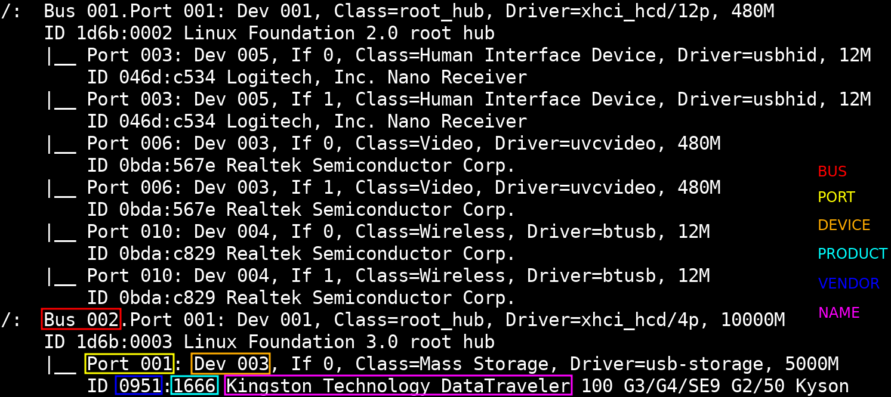

# Linux

Anotações gerais sobre Linux: programas e configurações.

Por via de regra, comandos de sistema são exemplificados utilizando abordagens Debian-like, então, caso esteja utilizando outra distribuição, deverá ser feito a adaptação necessária.

## Programas

Anotações gerais sobre ferramentas CLI (comandos).

### `sudo`

*Parâmetros usados:*

- `<password>`: Senha do usuário
- `<command>`: Comando fina completo

*Opções usadas:*

- `-S`: Aceita receber entrada via *pipe* (STDIN) e *new line* como delimitador
- `-k`: Reseta ou não salva a senha no *cache*
- `-v`: Valida ou atualiza o tempo de *cache* da senha

Passar senha via *pipe*:

```sh
echo -e "<password>\n" | sudo -S <command>
```

Renovar tempo de *cache* da senha:

```sh
sudo -v
```

Resetar tempo de *cache* da senha:

```sh
sudo -k
```

Executar sem guardar a senha em *cache*:

```sh
sudo -k <command>
```

### `su`

*Parâmetros usados:*

- `<shell>`: Nome do *shell* (*e.g.* `sh`, `bash`)
- `<user>`: Nome do usuário para *login*
- `<command>`: Comando final completo
- `<args>`: Parâmetros de opções

*Opções usadas:*

- `-c <command>`: Executa o comando no usuário especificado
- `-s <shell>`: Especifica o *shell* de login
- `-p`: Preserva o ambiente, como variáveis (não usado com `--login`)
- `-`, `-l`: Faz o *full login* no usuário, resetando todo o ambiente (recomendado)

"Logar" num *shell* interativo de outro usuário; Diretório de origem é preservado; Somente a variável `$HOME` é trocada (também `$USER` e `$LOGNAME` se usuário não for ***root***); Caso não especifique usuário, `root` é o padrão; Pode haver conflitos de ambiente por não ser um *full login*:

```sh
su [<user>]
```

"Logar" num *shell* interativo de outro usuário; Muda para a `$HOME` do usuário; Evita conflitos de ambiente:

```sh
su - [<user>]
```

Caso especificado o usuário, é possível passar opções do seu shell de login, por exemplo, se for `bash`, pode-se passar `-x` para o *trace*:

```sh
su [-] <user> [<args>]
```

*OBSERVAÇÕES:*

- Caso queira executar comandos em múltiplas linhas (*heredoc*), não é possível, utilize *line breaks* (`\` no final da linha)

### `id`

*Parâmetros usados:*

- `<uid>`: ID do usuário no sistema

Lista UID, GID e os grupos do usuário corrente:

```sh
id
```

Retorna somente o UID do usuário corrente:

```sh
id -u
```

Retorna somente o GID do usuário corrente:

```sh
id -g
```

Retorna o nome do usuário corrente:

```sh
id -un
```

Retorna o nome do usuário pelo UID passado:

```sh
id -un <uid>
```

### `newgrp`

Caso tenha feito a adição de um usuário a um grupo e não possa reiniciar a sessão para que a modiciação seja aplicada, o comando `newgrp` irá recarregar a sessão atual do *shell* do usuário corrente com o grupo específicado:

```sh
newgrp <group>
```

### `env`

Iniciar sessão `bash` completamente zerada:

```sh
env -i bash --norc --noprofile
```

### `hostname`

Saber hostname:

```sh
hostname
```

IP interno:

```sh
hostname -I
```

### `timedatectl`

*Parâmetros usados:*

- `<timezone>`: *Timezone* completo ou sua abreviação

Verificar informações de data e hora e se tudo esta *ok*:

```sh
timedatectl status
```

Sincronizar RTC com UTC (de onde a informação é buscada, não altera fuso horário):

```sh
timedatectl set-local-rtc 0
```

*OBSERVAÇÕES:*

- Para reverter faça:
	`timedatectl set-local-rtc 1`

Listar os *timezones*:

```sh
timedatectl list-timezones
```

Definir *timezone* no sistema:

```sh
timedatectl set-timezone <timezone>
```

*Timezones* com abreviações:

```sh
for timezone in `timedatectl list-timezones`; do echo "$timezone (`env TZ="$timezone" date '+%Z'`)"; done
```

Listar todas as abreviações de *timezones*:

```sh
timedatectl list-timezones | xargs -I '{}' env TZ='{}' date +'%Z' | sort -u
```

### `xev`

Mapear teclas e eventos do ambiente:

- `xev`
- `xev -event keyboard`
- `xev | sed -n '/^KeyPress/,/^$/p'`

### `shutdown`

Em geral, os comandos puros são:

- `halt`: Encerra todos os processos e desliga a CPU (matendo a energia do *hardware*)
- `poweroff`: Como `halt`, mas também envia um comando ACPI para a Placa Mãe (cortando toda a energia do *hardware*)
- `reboot`: Como `halt`, mas inicia novamente o sistema

O comando `shutdown` é um *handler* para todas essas instruções mas faz o "encerramento gracioso" dos processos.

*Parâmetros usados:*

- `<time>`: `hh:mm` no padrão 24h ou `+m` onde "m" é a quantidade de minutos a partir de agora, *e.g.* `+5` se refere daqui a 5 minutos (*default:* `+1`)
- `<wall>`: Mensagem de aviso de desligamento do sistema para os usuário "logados"

*Opções usadas:*

- `-H`: Para a máquina, *halt*
- `-P`: Desliga a máquina, *poweroff* (*default*)
- `-r`: Reinicia a máquina, *reboot*
- `-c`: Cancela a operação de *shutdown* pendente
- `--show`: Mostra (se houver) a operação de *shutdown* pendente

```
shutdown [<options>] [now|<time> [wall]]
```

*OBSERVAÇÕES:*

- A mensagem *wall* aparece somente nos terminais "logados"

### `efibootmgr`

*Parâmetros usados:*

- `X`: Letra do disco
- `Y`: Número da partição
- `<boot>`: ID da entrada de *boot*
- `<shim>`: Nome do binário de inicialização
- `<label>`: Nome da *label* da entrada de *boot*

*Opções usadas:*

- `-v`: Aumenta verbosidade da saída

Programas necessários:

```sh
[sudo] apt install efibootmgr
```

Listagem das entradas de *boot*:

```sh
efibootmgr [-v]
```

Remover entrada de *boot*:

```sh
efibootmgr -b <boot> -B
```

Adicionar nova entrada de *boot*:

```sh
efibootmgr -c -d /dev/sdX -p Y -l '\path\<shim>x64.efi' -L '<label>'
```

### `mokutil`

Checar se *secure boot* está ativo:

```sh
mokutil --sb-state
```

### `dd`

*Parâmetros usados:*

- `X`: Letra do disco
- `Y`: Número da partição

Criar pendrive "bootavel":

```sh
[sudo] dd if=/path/image.iso of=/dev/sdX bs=32M conv=fsync status=progress
```

Criar pendrive "bootavel" (ISO compactada):

```sh
gzip -dc /path/image.iso.gz | [sudo] dd of=/dev/sdX bs=32M conv=fsync status=progress
```

Criar *backup* de partição/HD:

```sh
[sudo] dd if=/dev/sdX[Y] of=/tmp/backup.hd bs=32M
```

Criando um *virtual disk* (VD):

1. `dd if=/dev/zero of=/tmp/vd.img bs=4M count=8`
1. `mkfs.vfat -F 32 /tmp/vd.img`
1. *`hexdump -C /tmp/vd.img | more`*
1. `mount -o loop,rw [-t vfat] /tmp/vd.img /mnt`
1. `cd /mnt/ && touch file.txt; cd -`
1. `umount /mnt`

### `fdisk`

*Parâmetros usados:*

- `X`: Letra do disco
- `Y`: Número da partição

Lista informações de todos os discos:

```sh
[sudo] fdisk -l
```

Lista informações de um disco específico:

```sh
[sudo] fdisk -l /dev/sdX
```

Interface interativo para manipulação avançada da tabela de partiçẽos e partiçẽos:

```sh
[sudo] fdisk /dev/sdX
```

*LINKS:*

- [MBR Partitions Types¹](<https://en.wikipedia.org/wiki/Partition_type>)
- [MBR Partitions Types²](<https://tldp.org/HOWTO/Partition-Mass-Storage-Definitions-Naming-HOWTO/x190.html>)
- [GPT Partitions Types](<https://en.wikipedia.org/wiki/GUID_Partition_Table#Partition_type_GUIDs>)
- [fdisk (archwiki)](<https://wiki.archlinux.org/title/fdisk>)

### `sfdisk`

*Parâmetros usados:*

- `<device>`: Nome do dispositivo
- `<partition>`: Número da partição
- `<sectors>`: Número de setores

*Backup* do esquema de partições do *device*:

```sh
sfdisk -d /dev/sdX > ./layout.dump
```

Restaurar *layout* de partições "backupiado":

```sh
sfdisk /dev/sdX < ./layout.dump
```

Mover partições (alterar o valor de início e fim dos blocos):

```sh
echo '+<sectors>,' | sfdisk --move-data <device> -N <partition>
```

Reordernar partições (caso alguma tenha sido excluida ou tinha sido criada no meio de outras):

```sh
sfdisk -r /dev/sdX
```

*OBSERVAÇÕES:*

- Com o sinal de `+`, move-se o ínicio do setor para o valor de setores passados em `<sectors>`

*LINKS:*

- [Reread/Resort Partitions](<https://serverfault.com/questions/36038/reread-partition-table-without-rebooting>) (em caso mudança de na ordenação das partições)

### `parted`

Listar os discos na máquina:

```sh
parted -l
```

### `mkfs`

Programas necessários para `fat32`:

```sh
[sudo] apt install mtools
```

Programas necessários para `exfat`:

```sh
[sudo] apt install exfatprogs
```

*Parâmetros usados:*

- `X`: Letra do disco
- `Y`: Número da partição

Formatar **fat32**:

- `-n`: Adiciona *label* na formatação

```sh
[sudo] mkfs.fat -F 32 [-n <label>] /dev/sdXY
```

Formatar **ext4**:

- `-L`: Adiciona label na formatação

```sh
[sudo] mkfs.ext4 [-L <label>] /dev/sdXY
```

Formatar **exfat**:

- `-L`: Adiciona label na formatação

```sh
[sudo] mkfs.exfat [-L <label>] /dev/sdXY
```

Formatar **ntfs**:

- `-Q`: Formatação rapida
- `-L`: Adiciona label na formatação

```sh
[sudo] mkfs.ntfs [-Q] [-L <label>] /dev/sdXY
```

### `losetup`

Listar todos os *loop devices*:

```sh
[sudo] losetup -a
```

Desmontar e remover um *loop device*:

1. Desmontar o *device*:
	```sh
	[sudo] umount /dev/loop9
	```
1. Desanexar os arquivos referentes a esse *device*:
	```sh
	[sudo] losetup -d /dev/loop9
	```
1. Remover o *device*:
	```sh
	[sudo] rm /dev/loop9
	```

### `mount`

*Parâmetros usados:*

- `X`: Letra do disco
- `Y`: Número da partição

Montar arquivo *iso*:

```sh
[sudo] mount -o ro -t iso9660 /path/img.iso /mnt
```

Montar partição *ext4* e manipular com usuário regular:

```sh
[sudo] mount -o user /dev/sdXY /mnt
bindfs -u `id -u` -g `id -g` /mnt /media/disk

# or

[sudo] mount /dev/sdXY /media/disk
chown -Rv `id -un`:`id -gn` /media/disk
```

*OBSERVAÇÕES:*

- **FAT32** e **EXFAT** não armazenam permissões POSIX nem proprietário/grupo. O Linux **simula** essas informações via opções de montagem (`uid`, `gid`, `umask`, `fmask`, `dmask`), fazendo todos os arquivos aparecerem com os mesmos atributos, sem essas opções, o padrão costuma ser `root`
- **EXT4** armazena *uid*, *gid* e permissões POSIX diretamente no *inode* de cada arquivo/diretório. Por isso opções de montagem como `uid` e `gid` não são suportadas ou necessárias, o dono real já está gravado no disco
- **NTFS** usa ACLs do Windows, não o modelo POSIX. No Linux, o driver `ntfs-3g` traduz ou simula proprietário e permissões via opções de montagem (`uid`, `gid`, `umask`), portanto o resultado depende da configuração de montagem e das ACLs originais do arquivo

### `findmnt`

Lista informações de pontos de montagem:

```sh
findmnt -T /mnt
```

### `lsblk`

*Parâmetros usados:*

- `X`: Letra do disco
- `Y`: Número da partição
- `<column>`: Nome da coluna (*header*)

Pegar informação de *device* específico:

```sh
lsblk -n [-o <column>[,...]] /dev/sdXY
```

Saber o nome dos *devices*:

```sh
lsblk -do NAME,MODEL
```

Saber se o disco é **HDD** ou **SSD** (`0` para SSD e `1` para HDD):

```sh
lsblk -do NAME,ROTA
```

Saber o tipo de conexão do disco:

```sh
lsblk -do NAME,TRAN
```

Informações gerais e úteis:

```sh
lsblk -o NAME,MODEL,TRAN,SIZE,ROTA,TYPE
```

### `jmtpfs`

*Parâmetros usados:*

- `<bus>`: Número do *bus*
- `<device>`: Número do *device*

Programas necessários:

```sh
[sudo] apt install jmtpfs
```

Saber informação do *device*:

```sh
[sudo] jmtpfs -l
```

Montar:

```sh
[sudo] jmtpfs /mount/point -device=<bus>,<device> -o allow_other
# or
[sudo] jmtpfs /mount/point -o allow_other,auto_unmount
```

Desmontar:

```sh
[sudo] umount /mount/point
# or
[sudo] fusermount -u /mount/point
```

### `gio`

*Parâmetros usados:*

- `<path>`: Caminho do dispositivo

Programas necessários:

```sh
[sudo] apt install gvfs-fuse gvfs-backends
```

Pegar informação do nome do *path* do *device*:

```sh
gio mount -li | grep -iF activation_root
```

Montar:

```sh
gio mount '<path>'
```

Desmontar:

```sh
gio mount -u '<path>'
```

### `lsattr`

Listar atributos do arquivo:

```sh
lsattr
```

### `chattr`

Adicionar atributo de imutabilidade:

```sh
[sudo] chattr +i /path/file.txt
```

Removendo atributo de imutabilidade:

```sh
[sudo] chattr -i /path/file.txt
```

Adicionar ou remover atributos recusivamente:

```sh
[sudo] chattr -R +i /path/folder/
```

### `modprobe`

*Parâmetros usados:*

- `<module>`: Nome do módulo

Verificar se um módolo já está carregado:

```sh
modprobe --dry-run --first-time <module> && echo "not loaded" || echo "loaded"
```

### `dmesg`

*Opções usadas:*

- `-w`: Modo *tail* (fica escutando a saída)
- `-H`: Mais legível para humanos
- `-C`: Limpa o cache do **dmesg**
- `-c`: Limpa o cache do **dmesg** depois de "printar" na tela

Sintaxe base:

```sh
[sudo] dmesg [<options>]
```

*OBSERVAÇÕES:*

- Antes de limpar o histórico, salve ele:
	`dmesg -H > /tmp/dmesg_$(date '+%F_%T').log`

### `systemctl`

*Parâmetros usados:*

- `<unit>`: Nome do serviço/*daemon*

*Opções usadas:*

- `--type`: Filtra pelo tipo de unidade
- `--state`: Filtra pelo estado da unidade
- `--reverse`: Mostra as dependências reversas (quais serviços dependem deste)

Listar todas as unidades do sistema:

```sh
systemctl list-units [--type service] [--state running]
```

Listar todas as dependências de uma unidade:

```sh
systemctl list-dependencies [--reverse] <unit>.service
```

Caso o sistema não tenha voltado do congelamento:

```sh
systemctl thaw '*'
```

### `journalctl`

*Parâmetros usados:*

- `<unit>`: Nome do serviço/*daemon*
- `<boot>`: Número sequêncial do *boot* (decrescente)

*Opções usadas:*

- `-x`: Deixa a saída visualmente mais legível (*pretty*)
- `-f`: Fica seguindo/escutando o *log* (equivalente ao `tail -f`)
- `-u <unit>`: Especifique o nome do serviço (aceita múltiplos `-u`)
- `-b [<boot>]`: Nulo ou `-0` = *boot* atual, `-1` = último *boot* e etc
- `-n <lines>`: Imprime as última *n* linhas
- `--no-pager`: Não use um paginador e imprime tudo diretamente no terminal
- `--list-boots`: List o histórico de *boots*
- `--disk-usage`: Mostra quanto de disco os *logs* estão consumindo

*Opções usadas:*

- <details>
	<summary><code>-p {&lt;priority&gt;|&lt;code&gt;}</code>: Filtra por prioridade</summary>

	- `emerg` (`0`): O sistema está inutilizável
	- `alert` (`1`): Medidas devem ser tomadas imediatamente
	- `crit` (`2`): Condições críticas
	- `error` (`3`): Condições de erro
	- `warning` (`4`): Condições de aviso
	- `notice` (`5`): Condição normal, mas significativa
	- `info` (`6`): Mensagem informativa
	- `debug` (`7`): Mensagens que são úteis para depuração
- <details>
	<summary><code>-o &lt;format&gt;</code>: Formata a saída</summary>

	- `cat`: Inclua apenas mensagens dos *logs*
	- `short`: Forma padrão
	- `json`: JSON *raw*
	- `json-pretty`: JSON indentado
	- `verbose`: *Log* completo
- <details>
	<summary><code>--since &lt;time&gt; [--until &lt;time&gt;]</code>: Filtra desde alguma data ou por um <i>range</i> de data</summary>

	- `2021-11-23 23:02:15`
	- `2021-05-04`
	- `12:00`
	- `5 hour ago, or 32 min ago`
	- `yesterday`, `today`, `now`
</details>
</details>
</details>

Seguir os *logs* de um serviço:

```sh
[sudo] journalctl -xfeu <unit>[.service]
```

Remover/Limpar os *logs*:
```sh
[sudo] journalctl --rotate --vacuum-size <size> [--unit <unit>.service]
```

### `sysctl`

Trocar a porcentagem de uso (que está sobrando) para que a *swap* seja ativada:

```sh
[sudo] sysctl vm.swappiness=90
```

*OBSERVAÇÕES:*

- 60 é o padrão, quanto maior, "menos" *swap* será usado. No caso, se quiser que a *swap* seja ativa com 90% de uso, defina o valor para 10

Aumentar o "desejo" de manter o *cache* da RAM:

```sh
[sudo] sysctl vm.vfs_cache_pressure=75
```

*OBSERVAÇÕES:*

- 100 é o padrão, quanto menor o valor, mais tempo mantem o cache

Caso atualize o arquivos de configuração do usuário como `/etc/sysctl.d/99-sysctl.conf`, utilize o comando para aplicar de imediato os parâmetros ao invés de esperar reiniciar o SO:

```sh
[sudo] sysctl --system
```

### `last`

Lista o histórico de *logins* no *host*:

```sh
last [--fulltimes] [--ip] [--limit <count>] [--system]
```

### `passwd`

*Parâmetros usados:*

- `<user>`: Nome de usuário no sistema

Alterar a senha de um usuário:

```sh
[sudo] passwd <user>
```

Limpar a senha de um usuário:

```sh
[sudo] passwd -d <user>
```

Bloquear a senha de um usuário:

```sh
[sudo] passwd -l <user>
```

Desbloquear a senha de um usuário:

```sh
[sudo] passwd -u <user>
```

*OBSERVAÇÕES:*

- Simplesmente limpar a senha do usuário o fara ficar sem senha, ou seja, ele ficará sem este meio de autenticação, *e.g.* se tentar "logar" na conta do usuário, não pedirá a senha
- Bloquear e desbloquear a senha de uma usuário implica somente na senha do mesmo, ou seja, caso bloqueamos a senha de um usuário, ele poderá fazer login por outro meio (algum tipo de chave por exemplo)
- Caso queira bloquear/desativar a conta do usuário, poderá limpar a sua senha (`-d`) e depois bloquea-la (`-l`), após isso, só podera "logar" pelo usuário de forma direta criando uma nova senha para o mesmo

### `pwgen`

*Parâmetros usados:*

- `<chars>`: Quantidade de caracteres por senha
- `<passwords>`: Quantidade de senhas a serem geradas

*Opções usadas:*

- `-s`: Senha completamente randômica
- `-c`: Garante letras maúsculas e minúsculas
- `-n`: Garante números
- `-y`: Inclui caracteres especiais

Programas necessários:

```sh
[sudo] apt install pwgen
```

Gerar senha aleatória (**$**):

```sh
pwgen [-scny] [<chars>] [<passwords>]
```

### `firejail`

*Parâmetros usados:*

- `<binary>`: Nome do executável
- `<sandbox>`: Nome dado ao *sandbox*
- `<command>`: Comando final completo
- `<ipv4>`: Endereço IPv4

Programas necessários:

```sh
[sudo] apt install firejail
```

Executar o *shell* padrão em *sandbox*:

```sh
firejail
```

Executar a aplicação em *sandbox*:

```sh
firejail [--noprofile] [--nodbus] [--private] <binary>
```

Lista os processos executando sob *firejail*:

```sh
firejail --list
```

Executar o programa o impedindo de se conectar com a *internet* (o aplicativo não vê interfaces de rede):

```sh
firejail --protocol=unix <binary>
```

Executa o firejail criando uma nova e vazia pasta pessoal para o ***root*** e para o **usuário regular**:

```sh
firejail [--name=<sandbox>] --private
```

Listagem de diretórios dentro do *sandbox*:

```sh
firejail --ls=<sandbox> /path/[file.txt]
```

Copiar arquivo de dentro do *sandbox*:

```sh
firejail --get=<sandbox> /path/[file.txt]
```

Entrar no *sandbox* ou executar algum comando nela:

```sh
firejail --join=<sandbox> [<command>]
```

Copiar algo do *host* para o *sandbox*:

```sh
firejail --put=<sandbox> /path/host/file.txt /path/sandbox/file.txt
```

*OBSERVAÇÕES:*

- O *firejail* isola a aplicação da sua *home*, porém, não do restante do sistema de arquivos (porque em tese já pertence ao *root*)
- Por padrão, caso o *firejail* não tenha um perfil específico para a aplicação que executará, ele usurá um perfil genérico (o que pode causar problemas)

*LINKS:*

- <https://easylinuxtipsproject.blogspot.com/p/sandbox.html>

#### *Troubleshooting*

Problemas com áudio usando `pulseauido` como driver:

1. `mkdir -pv ~/.config/pulse`
1. `cp -v /etc/pulse/client.conf ~/.config/pulse`
1. `echo 'enable-shm = no' >> ~/.config/pulse/client.conf`

Problemas com falta de *internet* ao usar `--private` pode ser falta de DNS:

```
firejail --private --dns=<ipv4>[ ...] <command>
```

Para executar Google Chrome:

```sh
firejail --private google-chrome --no-sandbox --no-first-run
```

Caso ainda tenha problemas com Google Chrome e esteja no Wayland:

```sh
firejail --noprofile --private --env=MOZ_ENABLE_WAYLAND=1 --dns=1.1.1.1 google-chrome --no-sandbox --ozone-platform=wayland --disable-vulkan --no-first-run
```

### `smem`

- `USS` (_Unique Set Size_): Memória exclusiva do programa (não inclui memória compartilhada (ex. _libs_))
- `PSS` (_Proportional Set Size_): USS junto com memória compartilhada dividida igualmente pelos processos que a usam
- `RSS` (_Resident Set Size_): USS com memória compartilhada total

*Parâmetros usados:*

- `<binary>`: Nome do executável

Ver consumo de memória:

```sh
smem -tkr [-a] [-s {uss|pss}] [-c 'pid command uss pss'] [-P <binary>]
```

### `date`

Imprime o formato padrão de hora com o *timezone* definido pelo seu sistema:

```sh
date
```

Imprime saida formatada (`yyyy-mm-dd hh:mm:ss`):

```sh
date '+%Y-%m-%d %H:%M:%S'
```

Imprime os segundos desde a **Época** (`1970-01-01 00:00:00 UTC`)

```sh
date '+%s'
```

Converter segundos (desde a **Época**) em data:

```sh
date --date='@<seconds>' '+%F %T'
```

Retorna a data adiantada:

```sh
date --date="TZ=\"$(date +%Z)\" +1 hour"
```

Passar fuso horário específico:

```sh
# timezone
TZ='Asia/Tokyo' date

# abbreviation
TZ='EST' date
```

### `tree`

*Parâmetros usados:*

- `<depth>`: Inteiro de profundidade
- `<pattern>`: *String* de RegEx

*Opções usadas:*

- `-a`: Lista arquivos ocultos
- `-F`: Sufixa diretórios com `/`
- `-C`: Define *color always*
- `-p`: Exibe permissões
- `-L <depth>`: Limita a quantidade de níveis de diretórios na busca
- `-P <pattern>`: Retorna somente o que casar com o padrão
- `-I <pattern>`: Exclui os arquivos e pastas do padrão

Listar estrutura de diretórios em formato de árvore:

```sh
tree [<options>]
```

Busca o caminho de somente um arquivo:

```sh
tree /path/folder --matchdirs --prune -P <pattern>
```

### `cut`

Pegar a coluna 1 e 7 do arquivo `/etc/passwd` pelo delimitador `:`:

```sh
cut -d ':' -f 1,7 /etc/passwd
```

Pegar do 1º até o 3º caractere de cada linha:

```sh
cut -c 1-3 /etc/passwd
```

Mudar o delimitador de saída padrão:

```sh
cut -d ' ' -f 3,4 --output-delimiter=',' /path/file.txt
```

### `du`

*Opções usadas:*

- `-s`: Simplifica a saída mostrando somente os arquivos na raiz
- `-c`: Mostra a somatória total de todos os arquivos contados
- `-h`: Unidades de medida mais legíveis

Mostra o tamanho dos arquivos e pastas:

```sh
du -sch /path/folder/*
```

### `df`

*Opções usadas:*

- `-h`: Unidades de medida mais legíveis

Mostra partições e tamanho dos discos:

```sh
df -h
```

### `ncdu`

*Parâmetros usados:*

- `<folder>`: Caminho do diretórios raiz a ser analisa (*default:* diretório atual)

Gerenciar graficamente via terminal (TUI) arquivos por tamanho:

```sh
ncdu [<folder>]
```

### `ln`

*Hard Link* (Conexão Física):

- Não podem ser feitos por arquivos que estão em outros pontos de montagem
- O *link* tem o mesmo *inode* do original
- Se o original for corrompido o *link* fica independente

Symbolic Link (Conexão Simbólica):

- Tem que passar o *path* completo para este tipo de conexão
- O *link* terá um *inode* diferente do arquivo original
- Se arquivo original for corrompido o *link* quebrará

*Opções usadas:*

- `-s`: Cria um *link* simbólico
- `-f`: Força a criação do *link*
- `-v`: Aumenta verbosidade da saída

Criar *link* físico:

```sh
ln /path/original/file.txt /path/hardlink
```

Criar *link* simbólico:

```sh
ln -s /path/original/file.txt /path/symlink
```

### `tar`

*Parâmetros usados:*

- `<path>`: Caminho para arquivo ou pasta
- `<folder>`: Caminho para pasta

*Opções usadas:*

- `-z`: Para manipulação de arquivos `.gz`
- `-c`: Para criar arquivos compactados
- `-v`: Modo verboso (imprime o processamento)
- `-x`: Para fazer extração de arquivos `.tar`
- `-t`: Para fazer listagem de arquivos compactados
- `-f <path>`: Informa o arquivo compactado daquela operação
- `-C <folder>`: Para descompactar em outra pasta

#### `.tar.gz`

Compactar em `.tar.gz`:

```sh
tar -zcvf archive.tar.gz /path/file.txt /path/folder/
```

Descompactar de `.tar.gz`:

```sh
tar [-C /path/decompress/] -zxvf /path/archive.tar.gz
```

#### `.tar.xz`

Compactar em `.(tar|tbz2).(xz|bz2)`:

```sh
tar -cvf archive.tar.gz /path/file.txt /path/folder/
```

Descompactar de `.(tar|tbz2).(xz|bz2)`:

```sh
tar [-C /path/decompress/] -xvf /path/archive.tar.xz
```

#### `.tar.\*`

Ver conteúdo de `.tar.*`:

```sh
tar -tf /path/archive.tar.gz
```

### `zip`

*Parâmetros usados:*

- `<folder>`: Caminho para pasta
- `<pattern>`: *String* de RegEx

*Opções usadas:*

- `-r`: Faz a compressão ser recursiva
- `-y`: Segue o *symlink* e compacta o arquivo original
- `-e`: Criptografar o arquivo compactado
- `-@`: A lista de arquivos/diretórios a serem compactados vem via STDIN
- `-FS`: Caso o arquivo não exista mais no *filesystem*, exclui do arquivo compactado
- `-b <folder>`: Especifica o diretório para o arquivo temporario (de cache) do *zip*
- `-i <pattern>[ ...]`: Inclue arquivos pelo padrão
- `-x <pattern>[ ...]`: Exclui arquivos pelo padrão

Compactar:

```sh
zip [-b /tmp] [-ry] archive[.zip] /path/file.txt /path/folder/ /path/folder/*
```

*OBSERVAÇÕES:*

- O primeiro argumento do comando é o *path* do arquivo compactado final e colocar a extensão `.zip` é opcional uma vez que o próprio comando coloca automáticamente caso não passado
- Caso não específicado, o **local padrão** do **arquivo temporário** é no **mesmo lugar** aonde será criado o **arquivo "zippado"**

Exemplos de padrões de inclusão/exclusão:

- Exclua todos os arquivos que terminam com ".txt" de todas as pastas em todos os níveis: `\*.txt`
- Exclua todos os arquivos que terminam com ".txt" de todas as pastas que tenham o nome em todos os níveis: `\*/folder/\*.txt`
- Exclua todas as pastas com o(s) nome(s) em todos os níveis: `\*/folder/\*` ou `\*/folder-{a,b}/\*`
- Exclua a pasta com o nome a partir da sua raiz (pastas a serem compactadas): `/depth0/folder/*`

### `unzip`

*Parâmetros usados:*

- `<folder>`: Caminho para pasta

*Opções usadas:*

- `-l`: Listar o conteúdo do arquivo compactado
- `-d <folder>`: Especifica a pasta para ser descompactado

Descompactar:

```sh
unzip [-d /path/decompress/] /path/archive.zip
```

Ver o conteúdo:

```sh
unzip -l /path/archive.zip
```

### `gzip`

- `-d`: Para descompactar arquivo
- `-k`: Descompacta o arquivo mantendo o compactado original
- `-v`: Modo verboso (imprime o processamento)

Compactar:

```sh
gzip /path/file.txt
```

Descompactar:

```sh
gzip -d [-kv] /path/file.txt.gz
```

### `xz`

*Opções usadas:*

- `-z`: Para criar arquivos compactados
- `-d`: Para descompactar arquivos
- `-k`: Descompacta o arquivo mantendo o compactado original
- `-v`: Modo verboso (imprime o processamento)

Compactar:

```sh
xz -z [-v] /path/file.txt
```

Descompactar:

```sh
xz -d [-kv] /path/file.txt.xz
```

### `7z`

*Opções usadas:*

- `x`: Para descompactar arquivos

Descompactar:

```sh
7z x /path/archive.*
```

### `sort`

*Parâmetros usados:*

- `<char>`: Qualquer caractere
- `<field>`: Identificador do campo

*Opções usadas:*

- `-m`: Mescla os arquvios antes de organizar
- `-t`: Especifica o delimitador
- `-k`: Especifica por campo

Organizar arquivos por ordenação:

```sh
sort [-m] [-t <char>] [-k <field>] /path/file.txt[ ...] [> /path/save.txt]
```

### `shuf`

Embaralhar linhas do arquivo:

```sh
shuf /path/file.txt
```

Embaralhar, pegar a última linha e exclui-la:

```sh
line=$(shuf /path/file.txt | tail -1); echo $line; sed -ni "/$line/d" /path/file.txt
```

### `sleep`

Sintaxe base:

```sh
sleep <time>[s|m|h|d][ ...]
```

Comando:
```sh
# sleep 1 minute and 30 seconds
sleep 1m 30s
```

*OBSERVAÇÕES:*

- Cada valor de tempo passado para o *sleep* será somado
- Caso não especificado unidade de tempo,`s` (segundos) é o padrão
- Segundos "quebrados" são permitidos (*e.g.* `0.5`, `.5`)

### `head`

Recortar primeira linha de um novo arquivo:

```sh
head -1 /path/file.txt > /path/new.txt
```

Recortar primeira linha de um arquivo para o mesmo arquivo:

```sh
echo $(head -1 /path/file.txt) > /path/file.txt
```

Listar do final a partir da linha *N*:

```sh
head -n -<line>
```

### `tail`

Recortar última linha de um novo arquivo:

```sh
tail -n 1 /path/file.txt > /path/new.txt
```

Recortar última linha de um arquivo para o mesmo arquivo:

```sh
echo $(tail -n 1 /path/file.txt) > /path/file.txt
```

Listar do início a partir da linha *N*:

```sh
tail -n +<line>
```

### `unset`

Variáveis:

```sh
unset <variable>
```

Funções:

```sh
unset -f <function>
```

### `unalias`

Aliases:

```sh
unalias <alias>
```

### `ls`

*Opções usadas:*

- `-a`: Exibe arquivos ocultos
- `-A`: Exibe arquivos ocultos exceto `.` e `..`
- `-i`: Exibe *inode* dos arquivos
- `-l`: Saída longa (tipo de arquivo, dono, grupo, tamanho e `mtime`)
- `-h`: Saída humana (unidade de medida legível para humanos)
- `-t`: Ordena por `mtime`
- `-d`: Não expande diretórios (quando usando *globs*)
- `-F`: Sufixa diretórios com `/`
- `--color={auto|never|always}`: Definir modo de cor da saída (*default:* `auto`)

Sintaxe base:

```sh
ls [<options>] [<path>]
```

### `cd`

Voltar para o diretorio anterior:

- Utilizando `-`:
	```sh
	cd -
	```
- Utilizando `$OLDPWD`:
	```sh
	cd $OLDPWD
	```

### `read`

*Parâmetros usados:*

- `<text>`: *String* qualquer conforme necessidade
- `<chars>`: Contagem de quantidade de caracteres

*Opções usadas:*

- `-r`: Retorna o texto *raw*, não interpreta caracteres de escape (*e.g.* `\n`)
- `-e`: Na prática, não interpreta teclas de movimentação, ou seja, consegue andar pelo texto com as setas (consequentemente, estes não são capturas pelo *read*)
- `-t`: Define um *timeout* para cancelamento do comando
- `-a`: A entrada será um *array*, ou seja, a cada espaço, um novo índice
- `-p`: Imprime uma mensagem antes do cursor
- `-i <text>`: Caso utilizando *ReadLine* (opção `-e`), define um *input* padrão
- `-n <chars>`: Retorna depois de *n* caracteres e, caso receba o delemitador de linha (tecla *return*) antes, não o inclui no *input*
- `-N <chars>`: Igual ao `-n`, porém, inclui o delimitador de linha caso retorne antes

Exemplo base:

```sh
read -re -t 5 -a ARRAY -p 'Your name: ' -i 'Tux'
```

*OBSERVAÇÕES:*

- Caso você precise "printar" algum caracter de escape ou algum tipo de formatação de texto para pedir a entrada do usuário e queira utilizar a técnica `echo -ne "\nInput: "; read -e`, pode ter comportamento inesperado pois, o texto "printado" (na mesma linha) antes da execução do `read`, será literalemente apagado caso você use o `backspace` até o final. Para contornar isso, é necessário a presença da opção `-p` do `read`, nem que seja para simplesmente printar o ": " final: `echo -ne "\nInput"; read -e -p ': '`

### `less`

*Parâmetros usados:*

- `<mark>`: Nome da marca, geralmente uma letra (*e.g.* `a`, `b`, `c`)
- `<line>`: Número da linha designada

*Comandos usados:*

- `:-i`: *Toggle case insensitive* para buscas simples
- `:-I`: *Toggle case insensitive* para buscas também com padrões
- `:-N`: *Toggle case insensitive* para mostrar linhas
- `:m`: Define uma marca para a página atual
- `'<mark>`: Vai para a marca
- `<line>g`: Vai para a linha

### `grep`

*Parâmetros usados:*

- `<count>`: Inteiro de quantidade de vezes
- `<lines>`: Inteiro de quantidade de linhas
- `<pattern>`: *String* de RegEx
- `<path>`: Caminho para arquivo ou pasta
- `<command>`: Comando final completo

*Opções usadas:*

- `-i`: *Case insensitive*
- `-r`: Recursividade não seguindo *symlinks*
- `-n`: Número da linha da ocorrência
- `-h`: Nome do arquivo da ocorrência
- `-s`: Suprime somente mensagens de erro
- `-v`: Inverte a ocorrência (retorna todas as linhas que não casaram)
- `-o`: Retorna somente a ocorrência da linha (e não a linha toda)
- `-R`: Recursividade seguindo *symlinks*
- `-E`: Expressão Regular extendida
- `-P`: Expressão Regular PCRE
- `-I`: Rejeita arquivos binários na busca
- `-m <count>`: Pare depois de *n* ocorrências
- `-A <lines>`: Mostra *n* linhas à baixo da *match line*
- `-B <lines>`: Mostra *n* linhas à cima da *match line*
- `-C <lines>`: Mostra *n* linhas ao redor da *match line*

Sintaxe base:

```sh
grep [<options>] <pattern> {/path/file.txt|/path/folder/}[ ...]
```

Exemplos de exclusão:

- Arquivos:
	```sh
	grep --exclude=*file{4,2}* <pattern> <path>
	```
- Diretórios:
	```sh
	grep --exclude-dir={dir1,dir2} <pattern> <path>
	```

*OBSERVAÇÕES:*

- As exclusões irão excluir todos os arquivos e(ou) diretórios independente do nível do lugar que o grep estiver percorrendo que casar com a cadeia do `exclude` passado a partir da pasta *root*

Pegar a(s) linha(s) mais longa(s) de um arquivo:

```sh
grep -P "^.{$(wc -L < /path/file.txt)}$" /path/file.txt
```

Pegar a(s) linha(s) mais longa(s) de um comando:

```sh
<command> | grep -P "^.{$(<command> | wc -L)}$"
```

### `sed`

*Parâmetros usados:*

- `<pattern>`: *String* de RegEx
- `<replacement>`: *String* de substituição

*Opções usadas:*

- `-n`: Suprime a saída padrão e mostra somente o *match*

Substituir nova linha por algum caracter:

```sh
sed -z 's/\n/; /g' /path/file.txt
```

Buscar as linhas que dão *match* e retornar somente o *pattern* do grupo especificado (*e.g.* `\1` para o primeiro grupo, `\2` para o segundo e assim por diante):

```sh
sed -nE 's/field: (.*)/\1/p' /path/file.txt
```

*OBSERVAÇÕES:*

- É como se o `sed` buscasse a linha e a recortasse (equivalente a uma *pipeline* de `grep | cut | sed | tr`)

Parar na primeira linha casada:

```sh
sed -nE '/<pattern>/{p;q}' /path/file.txt
```

*OBSERVAÇÕES:*

- É como se o `sed` percorresse as linhas de entrada até encontrar o primeiro *pattern* descrito no exemplo, depois, executasse o que está dentro do bloco de condição (`{}`) que seria "printar" (`p`) e (`;`) sair (`q`)

Substituição somente nas linhas que casam:

```sh
sed '/<pattern>/s/<pattern>/<replacement>/' /path/file.txt
```

Imprimir somente o *range* de linhas especificado:

```sh
sed -n '/<pattern>/,/<pattern>/p'
```

Remover todos caracteres de escape ANSI:

```sh
sed -nE 's/^.*\x1b\[([0-9]+;?)+m(.*)\x1b\[.*$/\2/p'
```

Cria backup na hora de efetivar as alterações & alterações em lote:

```sh
grep -rl '<pattern>' | xargs sed -Ei'.bak' '<pattern>'
```

Excluir a última linha de um arquivo:

```sh
sed "$(wc -l < file.txt)d" /path/file.txt
```

### `find`

Sintaxe base:

```sh
find /path/folder -name file.txt
```

Limitando a recursividade:

```sh
find /path/folder -maxdepth 3 -name file.txt
```

Excluir determinado path da busca:

```sh
find /path/folder -path /path/folder/exclude -prune -o -name '*file*'
```

Excluir vários paths da busca:

```sh
find /path/folder \( -path /path/folder/first -o -path /path/folder/second \) -prune -o -name '*file*'
```

Excluir vários paths da busca e limitar a recursivedade:

```sh
find /path/folder -maxdepth 2 \( -path /path/folder/first -o -path /path/folder/second \) -prune -o -name '*file*'
```

Buscar por arquivos e excluílos:

```sh
find ~/ -not \( -path '*/.*' -prune -o -path '*/folder' -prune \) -iname '*confli*' -exec rm -i '{}' \; 2>&-
```

Buscar por links simbólicos quebrados e excluílos:

```sh
find ~/ -xtype l -exec rm -fv '{}' \;
```

Find `printf`:

```sh
find ~/ -printf '%C+\t%p\n'
```

Sair na primeira ocorrência:

```sh
find ~/ -name file.txt -print -quit
```

*OBSERVAÇÕES:*

- Pastas para a opção `-path` não pode contem `/` no final
- Para qualquer tipo de *match pattern* (inclusive para diretórios), é aceito *wildcards* (*e.g.* `find ~/ \( -path '*/folder' -o -path '*/.folder' \) -prune -o -name '*f?le*'`)
- Utilizando `\;` para finalizar o `find`, fará com que cada ocorrência seja um novo comando, porém, com `\+`, fará a concatenação (*e.g.* `<command> <arg1> <arg2> ...`)

### `locate`

Sintaxe base:

```sh
locate file
```

Buscar por nome exato:

```sh
locate -b '\file.txt'
```

### `xargs`

Pega a saida do pipe e concatena no final do comando que está a frente dele.

Exemplos base:

```sh
cat file.txt | xargs [sudo] apt install -y
```

```sh
xargs -a file.txt [sudo] apt install -y
```

```sh
find ./ -iname '*.mp3' | xargs rm -fv
```

### `file`

Mostra o tipo do arquivo e seu *path*:

```sh
file /path/file.txt
```

### `stat`

Ver informações e metadados de arquivos:

```sh
stat /path/file.txt
```

### `wget`

*Opções usadas:*

- `-P`: Diretório alternativo para salvar o arquivo
- `-O`: Mudar o nome de saida do arquivo
- `-c`: Continua um *download* que foi interrompido
- `-r`: Baixa pastas de forma recursiva
- `-np`: Se especificar uma pasta de *download*, não baixa o conteúdo das pastas pai (superiores)
- `--backups 0`: Sobrescrever o arquivo caso ele já exista

Sintaxe base:

```sh
wget [-P /path/save/|-O file.txt] <url>
```

Ao invés de salvar, envia para STDOUT:

```sh
wget -O - <url>
```

*OBSERVAÇÕES:*

- As opções `-P` e `-O` não podem ser usadas juntas
- Use a opção `-c` estando na pasta aonde está o arquivo de *download* interminado

### `curl`

*Parâmetros usados:*

- `<url>`: Endereço do arquivo a ser baixado
- `<path>`: Caminho para arquivo ou pasta
- `<type>`: Tipo da requisição (*e.g.* `GET`, `POST`)
- `<user>`: Nome de usuário de acesso
- `<password>`: Senha de acesso do usuário
- `<header>`: O cabeçalho da request é *case-insensitive* defino pela sintaxe `<chave>: <valor>` (*e.g.* `Content-Type: application/json` ou `content-type: application/json`)
- `<field>`: Identificador da *tag* HTML no *site*
- `<content>`: Qualquer valor possível para determinado tipo

*Opções usadas:*

- `-f`: Caso a *request* retorne algum código de erro, suprime a saída (*body response*)
- `-s`: Silencia o *curl*, suprime o progresso ou mensagens de erro, porém, mostra a *response* normalmente
- `-S`: Mostra o erro, caso ele ocorra enquanto a saída está silênciada (`-s`)
- `-L`: Tenta seguir redirecionamentos de URL
- `-d`: Específica o *body* da requisição
- `-k`: Desabilita verificações de segurança (*SSL* e etc)
- `-v`: Aumenta verbosidade da saída
- `-i`: Retorna o cabeçalho da requisição
- `-X <type>`: Tipo da *request*
- `-H <header>`: Define cabeçalho da *request* (aceita múltiplos `-H`)
- `-u <user>[:<password>]`: Credenciais para autênticação única
- `-o <path>`: Informa o nome e o local do arquivo de saída
- `-w '%{<variable>}\n[...]'`: Retorna somente a [chave específica](<https://curl.se/docs/manpage.html#:~:text=The%20variables%20available%20are%3A>) da *response*

Sintaxe base:

```sh
curl [-o /path/file.txt] -fsSL <url>
```

Popular *field* no HTML de determinado endereço:

```sh
curl -d "<field>=<content>" <url>
```

#### *Content-Type*

JSON:

```sh
curl [-H 'content-type: application/json'] -d '{"param1":"value1","param2":"value2"}' <url>
```

URL Encoded (espaços em branco trocados por `+`):

```sh
curl [-H 'content-type: application/x-www-form-urlencoded'] -d 'param1=value1&param2=value2' <url>
```

Form Data:

```sh
curl [-H 'content-type: multipart/form-data'] -F 'param1=value1' -F 'file=@/path/file.txt' <url>
```

XML:

```sh
curl [-H 'content-type: application/xml'] -d '<root><element>value</element></root>' <url>
```

### `ufw`

Programas necessários:

```sh
[sudo] apt install ufw
```

Gerar *backup* das regras:

```sh
# cutting the first line
ufw show added | tail -n +2 > /path/ufw.txt
# cutting the line starts with
ufw show added | sed -E '/^[aA]dded/d' > /path/ufw.txt
```

Restaurar *backup* das regras:

```sh
while read -r rule; do eval "sudo $rule"; done < /path/ufw.txt
```

### `history`

Salvar os comandos da sessão no histórico (manualmente, antes de encerrar o *shell*):

```sh
history -a
```

Carregar comandos do histórico que ainda não estão na sessão atual (pois foram adicionados por outra sessão):

```sh
history -r
```

Limpar histórico do terminal:

```sh
history -c
```

Não gravar comando no histórico (dê um espaço antes do comando):

```sh
 ls /tmp
```

Pesquisar algum comando no histórico:

```sh
ctrl+r
```

### `trap`

Comando *builtin* para interceptação de *SIGNALS*:

```sh
#!/bin/bash

# record new command to trap
trap "echo 'captured'" SIGTSTP EXIT

read -p 'Input: '
echo "$REPLY"

# reset signals to default
trap - SIGTSTP EXIT
```

Sinais to próprio comando `trap`:

- `EXIT`: Enviado no final do *script* e também quando capturado
	- `02`: **SIGINT** (`ctrl+c`)
	- `15`: **SIGTERM** (*kill*)
- `DEBUG`: Enviado antes de cada comando simples
- `RETURN`: Enviado no final do *script* quando for chamado com `.` ou `source`. Caso você defina o *trap* com esse sinal e depois o remova, terá que resetar o *shell* para que seu efeito passe
- `ERR`: Enviado depois de cada erro
- `WINCH`: Eviado quando a janela tem suas dimensões alteradas (diminuida ou aumentada)

*OBSERVAÇÕES:*

- Defina `set -o pipefail` para `ERR` conseguir capturar *pipelines*
- Defina `set -E` para `ERR` conseguir "exergar" os erros dentro de funções e *subshells*

### `yes`

*Loop* infinito de "echo" no STDOUT:

```sh
yes
```

Especificando a *string*:

```sh
yes n
```

### `progress`

*Parâmetros usados:*

- `<pid>`: ID do processo
- `<binary>`: Nome do executável
- `<command>`: Comando final completo

*Opções usadas:*

- `-m`: Monitora em *loop* até o comando morrer
- `-M`: Monitor ativo mesmo sem comandos sendo monitorados
- `-p <pid>`: Monitora o comando pelo PID
- `-c <binary>`: Monitora o comando pelo nome (*e.g.* `cp`, `mv`)

Exemplos base:

```sh
<command> & progress -mp "$!"
```

```sh
<command>; progress -mc <binary>
```

```sh
<command>; progress -Mc <binary>
```

```sh
progress -M [-c <binary>]
```

### `exec`

*Parâmetros usados:*

- `<command>`: Comando final completo

O comando *exec* "substitui" o *shell* atual pelo comando passado. Caso não seja passado passado nenhum argumento, o próprio *shell* atual será "substituido" por ele mesmo.

Quando executamos algum comando num *shell*, geralmente, ele cria um PID para esse comando rodar sob ele, ou seja, um sub-processo. O *exec* faz com que o comando passado como argumento herde o PID do *shell* atual e qualquer *signal* que o novo processo receber, o processo original (o *shell*) também receberá, ou seja, quando o novo processo encerrar, o *shell* atual também encerrará (porque eles tem o "mesmo" PID).

```sh
exec [<options>] [<command>]
```

*OBSERVAÇÕES:*

- Use quando quiser que logo depois do termino do comando o *shell* atual seja encerrado
- Use para redirecionar a saída do próprio *shell* para controles de logs (no final, um script também executa num *shell*)

### `scp`

Local > Remoto:

```sh
scp [-r] [-P <port>] /local/path [<user>][@][<host>]:/remote/path
```

Remoto > Local:

```sh
scp [-r] [-P <port>] [<user>][@][<host>]:/remote/path /local/path
```

### `gpg`

*Parâmetros usados:*

- `<key>`: ID da chave privada
- `<pubkey>`: ID da chave pública
- `<path>`: Caminho para arquivo

Gerar chave *gpg* (a geração é silenciosa e será guardada automáticamente no chaveiro *gpg*, para podermos vê-la, precisamos exporta-la):

```sh
gpg --full-gen-key
```

*OBSERVAÇÕES:*

- Para mudar o "nível de segurança da chave":
	- `gpg --edit-key <key>`
	- `gpg> trust`
	- *escolher*
	- `gpg> save`

Listar chaves públicas:

```sh
gpg -k
```

Listar chaves privadas:

```sh
gpg -K
```

*Fingerprint* das cahves (16 últimos caracteres da chave):

```sh
gpg --fingerprint
```

Gerar certificado de revogação:

```sh
gpg --gen-revoke <key> > /path/revocation.crt
```

Exportar chave pública (gerar o arquivo da chave pública):

```sh
gpg --export --armor <key> > /path/pubkey
```

Exportar chave privada (gerar o arquivo da chave privada):

```sh
gpg --export-secret-key --armor <key> > /path/key
```

Criptografar arquivo de forma simétrica (*passphrase*):

```sh
gpg --symmetric /path/file.txt
```

Descriptografar arquivo de forma simétrica (*passphrase*):

```sh
gpg [--no-symkey-cache] --decrypt /path/file.txt.gpg
```

Importar chave pública para o chaveiro:

```sh
gpg --import /path/pubkey
```

Assinar texto de entrada com chave de forma limpa (sem criptográfia):

```sh
gpg --clear-sign > /path/file.asc
```

Assinar texto de entrada com chave de forma "suja" (com criptográfia):

```sh
gpg --sign > /path/file.asc
```

Assinar arquivo com chave de forma limpa (sem criptográfia):

```sh
gpg --clear-sign /path/file.txt
```

Assinar arquivo com chave de forma "suja" (com criptográfia):

```sh
gpg --sign /path/file.txt
```

Validar a integridade do arquivo (verifica se a assinatura do arquivo condiz com o conteúdo):

```sh
gpg --verify /path/file.txt
```

Criptografar de forma assimétrica (*pair of keys*):

```sh
gpg --encrypt --recipient <pubkey> /path/file.txt
```

*OBSERVAÇÕES:*

- Nesse caso você não precisa informar o recipiente privado (a chave privada) pois, em tese, ela já está em seu chaveiro privado

Descriptografar já validando a integridade da mensagem ou arquivo:

```sh
gpg --output /path/file.txt --decrypt /path/file.txt.gpg
```

Desempacote blindagem ASCII e empacota blindando em OpenPGP (*output redirecting and pipe entring accepted*):

```sh
gpg --dearmor /path/key.asc
```

Tipos de entrada para senha:

- Via *default setting*: *não passe nenhuma opção*
- Via *hidden prompt*:
	`--pinentry-mode loopback`
- Via *plain text*:
	`--batch --passphrase <password>`
- Via *STDIN*:
	`<password> | --batch --passphrase-fd 0` ou
	`--batch --passphrase-fd 0 <<< <password>`

*OBSERVAÇÕES:*

- Todos os redirecionamentos de arquivos feitos podem ser substituídos pela opção do próprio comando (`--output <path>`), ou seja, isso implica que se não for especificado a saída, o STDOUT é o padrão (a tela)
- Todos os parâmetros `<key>` podem ser substituídos pelos meio de identificação da chave, *e.g.* *email* ou *fingerprint*

### `gsettings`

Mudar tema via CLI:

```sh
gsettings set org.gnome.desktop.interface gtk-theme "Theme Name"
```

Mudar icone via CLI:

```sh
gsettings set org.gnome.desktop.interface icon-theme "Icon Name"
```

Habilitar/Desabilitar a o bloquei de tela (e a suspenção) quando escurecer a tela:

```sh
gsettings set org.gnome.desktop.screensaver lock-enabled {true|false}
```

Habilitar modo ***dark*** como padrão:

```sh
gsettings set org.gnome.desktop.interface color-scheme prefer-dark
```

*OBSERVAÇÕES:*

- O tema que é escolhido (propriedade `gtk-name`) que deverá ser *dark* (caso queira que assim seja)
- A propriedade `prefer-dark` serve para aplicativos que tem seu próprio tema e com uma versão *dark*

### `basename`

Listar somente o nome do arquivo passando o *path* completo:

```sh
basename /path/file.txt
```

Listar com múltiplos *paths*:

```sh
basename -a /first/path/file.txt /second/path/file.txt
```

*OBSERVAÇÕES:*

- Com a opção `-a` do comando é possível usa-lo com `xargs`

Cortar a extensão do arquivo na saída:

```sh
basename -s .txt /path/file.txt
```

### `dirname`

Imprime o caminho de um *path* sem o último membro:

```sh
dirname /path/file.txt
```

### `realpath`

*Parâmetros usados:*

- `<path>`: Caminho para arquivo ou pasta
- `<folder>`: Caminho para pasta

*Opções usadas:*

- `-s`: *Links* simbólicos não são expandidos
- `-z`: Troca nova linha por nulo
- `--relative-to=<folder>`: Retorna o caminho relativo para chegar no arquivo por dentro da pasta passada

Retorna o caminho absoluto dos arquivos passados como argumento:

```sh
realpath [<options>] <path>[ ...]
```

*OBSERVAÇÕES:*

- Por padrão se o arquivo for um *link* simbólico, será expandido

### `readlink`

Retorna o caminho original de um *link* simbólico (*symlink*):

```sh
readlink -f /path/symlink
```

### `mktemp`

Gerar arquivos com nomes aleatórios:

```sh
mktemp XXXXXXX.tmp
```

Gerar pastas com nomes aleatórios:

```sh
mktemp -d XXXXXXX.tmp
```

Gerar capturando o nome:

```sh
temp="$(mktemp XXXXXXX.tmp)"
```

Gerando validando a operação:

```sh
if temp="$(mktemp XXXXXXX.tmp [2>&-])"; then
	# case created
else
	# case not created
fi
```

Caso queira validar somente se houver erro:

```sh
if ! temp="$(mktemp XXXXXXX.tmp [2>&-])"; then
	# case not created
fi
echo "temp: $temp"
```

### `diff`

*Parâmetros usados:*

- `<command>`: Comando fina completo

Diferença entre duas *strings*:

1.
	```sh
	diff [--color] 'foo' 'bar'
	```

Diferença entre dois arquivos:

1.
	```sh
	diff [--color] /path/file1.txt /path/file2.txt
	```
1.
	```sh
	diff [--color] <(<command>) <(<command>)
	```

*OBSERVAÇÕES:*

- É possível misturar *strings* e arquivos

#### Cabeçalho

Como ler o cabeçado de um comando `diff`? O cabeçalho de exemplo `@@ -37,6 +35,8 @@` significa:

- `-37,6`: Indica que as alterações começam na linha 37 do arquivo original e se estende por 6 linhas
- `+35,8`: Indica que as linhas adicionadas começam na linha 35 do novo arquivo e se estendem por 8 linhas

Ou seja, as linhas citadas na verdade não começam desde a primeira linha alterada mas da primeira linha mostrada de todo o contexto e o restante das linhas são o restante das linhas do contexto e não quantas linhas mais foram alteradas.

### `column`

*Parâmetros usados:*

- `<delimiter>`: Caractere que define a separação de informações
- `<header>`: Nome do cabeçalho
- `<column>`: É o nome das colunas que foram renomeadas, caso não tenham sido, por padrão são numeradas a partir do índice `1`

*Opções usadas:*

- `-t`: Cria a tabela
- `-L`: Mantem linhas vazia
- `-J`: Saída formatada em JSON
- `-s <delimiter>`: Delimitador de entrada
- `-o <delimiter>`: Delimitador de saída
- `-N <header>[,...]`: Nomeia as colunas
- `-H <column>[,...]`: Esconde as colunas determinadas
- `-R <column>[,...]`: Alinha as colunas à direita

Exemplos base:

```sh
column -tL -s ':' -o '|' /etc/passwd
```

```sh
column -tL -s ':' -o '|' -H 2,5 /etc/passwd
```

```sh
column -tL -s ':' -o '|' -N 'USERNAME,PASSWORD,UID,GID,GECOS,HOME,SHELL' /etc/passwd
```

```sh
column -tL -s ':' -o '|' -N 'USERNAME,PASSWORD,UID,GID,GECOS,HOME,SHELL' -H PASSWORD,GECOS /etc/passwd
```

Exemplo com `jq`:

```sh
column -J -tL -s ':' -o '|' -N 'USERNAME,PASSWORD,UID,GID,GECOS,HOME,SHELL' /etc/passwd | jq
```

### `paste`

*Parâmetros usados:*

- `<command>`: Comando fina completo

Coloca linhas lado a lado:

```sh
paste <(<command>) <(<command>)
```

Saída de comandos lado a lado:

```sh
paste <(<command>) <(<command>) | column -ts $'\t'
```

### `rsync`

*Parâmetros usados:*

- `<port>`: Porta da conexão SSH
- `<pattern>`: *String* de RegEx

*Opções usadas:*

- `-r`: Modo recursivo
- `-v`: Modo verboso
- `-h`: Aumenta a legibilidade
- `-a`: Aplica recursividade, preserva permissões, usuários, grupos e *timestamp* (*inode*)
- `-u`: Pula arquivos no qual o destino é mais novo
- `-z`: Comprime os dados trafegados deixando o tamanho do *payload* menor (consumindo mais processamento)
- `-P`: Mostra o progresso
- `-e 'ssh -p <port>'`: Muda a porta padrão (`22`) de conexão
- `--delete`: Caso algum arquivo da fonte não exista mais no destino, no destino também é excluído
- `--exclude=<pattern>`: Exclui arquivos ou diretórios, aceitando *glob* ou caminho absoluto
- `--include=<pattern>`: Inclui arquivos ou diretórios (que foram excluídos), aceitando *glob* ou caminho absoluto

Sintaxe base:

```sh
rsync [<options>] /path/folder1/ /path/folder2/ /path/file3.txt /path/backup/
```

Exemplo base:

```sh
rsync -auhv --include=.files-* --exclude={file1,folder2,.*} --exclude=*.bak /absolute/src/file1.txt relative/src/folder2/ /tmp/dst/backup/
```

*OBSERVAÇÕES:*

- O destino ou origem aceita o modo de *login* de protocolo `ssh` (`user@host:/path`)
- Caso a pasta de destino não exista o *rsync* criará automáticamente
- No *rsync* `/path/folder` representa o próprio arquivo, ou seja, na hora de fazer a cópia, copiará a pasta ***folder*** com os arquivos dentro, porém, se passar `/path/folder/` não está pegando o *basename* mas somente os arquivos dentro de ***folder***
- Por *default*, caso utilize o *rsync* com os mesmos *paths* de origem e destino, ele simplesmente faz a sincronia dos arquivos (copia somente oque foi alterado, ou seja, o que há de novo) e preserva do destino os que já foram excluídos da fonte (ver opção `--delete`)
- Opção `--exclude` é única para cada arquivo que deseja não sincronizar?

### `sha256sum`

Descobrir o *hash* de algum arquivo:

```sh
sha256sum /path/file.txt
```

### `md5sum`

Descobrir o *hash* de algum arquivo:

```sh
md5sum /path/file.txt
```

### `ncal`

*Parâmetros usados:*

- `<count>`: Quantidade de itens a serem mostrados
- `<month>`: Índice do mês a ser exibido (`1-12`)
- `<year>`: Ano a ser exibido (*e.g.* `2042`)

*Opções usadas:*

- `-B`: Mostra os meses **antes** desse (incluindo o atual)
- `-A`: Mostra os meses **depois** desse (incluindo o atual)
- `-3`: Mostra junto do atual o mês anterior e posterior
- `-j`: Mostra o número do dia (em relação ao ano)
- `-y`: Mostra todos os meses do ano
- `-w`: Mostra junto a contagem das semanas
- `-m`: Mostra um mês específico

Calendário CLI:

```sh
ncal -b [-{B|A}<count>] [-3] [-jyw] [-m <month>] [<year>]
```

### `apropos`

*Parâmetros usados:*

- `<about>`: Assunto a ser pesquisado

Pesquisar manpages para determinado assunto que case:

```sh
apropos <about>
```

### `slop`

*Opções usadas:*

- `-q`: Silencia a saída
- `-f`: Formata a saída

Programas necessários:

```sh
[sudo] apt install slop
```

Retorna a área selecionada no estilo `x,y+width+height` (`left,top+right+bottom`):

```sh
slop
```

Formatando a saída:

```sh
# %x: x axis
# %y: y axis
# %w: width
# %h: height
# %g: geometry (%wx%h+%x+%y)
# %i: window id
# %%: literal '%'
slop -f '%x %y %w %h %g %i'
```

### `qrencode`

*Opções usadas:*

- `-v`: Versão do tipo de *QR Code* (quanto maior, mais *pixels*)
- `-s`: Tamanho dos pixels do *QR Code*
- `-l`: Aumenta a quantidade de *pixels* do *QR Code*
- `-t`: Tipo do arquivo de saída
- `-m`: Largura das bordas da imagem
- `-o`: Caminho do *QR Code* gerado

Programas necessários:

```sh
[sudo] apt install qrencode
```

Gerar *QR Code*:

```sh
qrencode [-v 5] [-s 10] [-l H] -[t {PNG|SVG}] [-m 3] -o /path/qrcode.png {<url>|<email>|<phone>|<string>}
```

### `zbar*`

*Opções usadas:*

- `-q`: Silencia a saída
- `--raw`: Mostra somente o contéudo *raw* *QR Code*

Programas necessários:

```sh
[sudo] apt install zbar-tools
```

Ler *QR Code* de uma imagem:

```sh
zbarimg [--raw] [-q] /path/qrcode.png
```

Ler *QR Code* da câmera:

```sh
zbarcam [--raw] [-q]
```

### `flatpak`

Faça o setup pelo guia do [Flatpak](<https://flatpak.org/setup>) ou do [Flathub](<https://flathub.org/setup>).

*Parâmetros usados:*

- `<remote>`: Repositório remoto (*e.g.* `flathub`)
- `<app>`: *ID* do aplicativo remota ou localmente (*e.g.* `org.mozilla.firefox`)
- `<commit>`: *Hash* do *commit*

Instalar app flatpak:

```sh
flatpak install <remote> <app>
```

Listar apps flatpak:

```sh
flatpak list
```

Executar app flatpak:

```sh
flatpak run <app>
```

Informações app flatpak:

```sh
flatpak infos <app>
```

Desinstalar app flatpak:

```sh
flatpak uninstall <app>
```

Listar flatpak *remotes*:

```sh
flatpak remotes
```

Impedir/Liberar app flatpak de receber atualizações:

```sh
flatpak mask [--remove] <app>
```

#### *Rollback*

Listar as versões do app flatpak:

```sh
flatpak remote-info --log flathub <app>
```

Executa o *rollback* no app flatpak:

```sh
flatpak update --commit=<commit> <app>
```

#### *Games*

Por sugestão do [Eddie](<https://github.com/eddiecsilva/debian-post-install?tab=readme-ov-file#configura%C3%A7%C3%B5es-extras-para-jogos>), instalação dos pacotes necessários para **Steam** e **Heroic Games Launcher**:

```sh
flatpak install com.valvesoftware.Steam com.valvesoftware.Steam.Utility.MangoHud com.valvesoftware.Steam.Utility.vkBasalt com.valvesoftware.Steam.VulkanLayer.MangoHud com.heroicgameslauncher.hgl
```

> Se for necessário, utilizando o FlatSeal libere as permissões do pacote flatpak do Steam para acessar outras unidades de disco.

### *Runlevels*

Runlevels são os níveis de execução do sistema criados no *System V* (*SysV*). Cada Runlevel diz ao sistema em qual "camada" o sistema deve operar (qual o seu estado atual).

> Como também é um recurso de segurança do Linux, um dos critérios para saber se um devido processo deve ser executado ou não são os *Runlevels*?

Eles variam de `0-6`:

| Runlevel | Mode               | Action                                                     |
| :------- | :----------------- | :--------------------------------------------------------- |
| 0        | *Halt*             | Poweroff the system.                                       |
| 1        | *Mono-User*        | Recovery mode, does not configure network, only root user. |
| 2        | -                  | -                                                          |
| 3        | *Multi-User*       | Start the system without GUI.                              |
| 4        | -                  | -                                                          |
| 5        | *Graphical Server* | Start the system with GUI.                                 |
| 6        | *Reboot*           | Reboot the system.                                         |

Verificar o *runlevel* atual:

```sh
runlevel
```

Chamar (mudar para) *runlevel*:

```sh
telinit <runlevel>
```

*LINKS:*

- [Runlevels & Targets](<https://access.redhat.com/articles/754933>)

### *Targets*

Targets são equivalentes aos Runlevels, porém, foram criados no *Systemd*, com o mesmo conceito e com outra conveção.

Num sistema com `systemd` os Runlevels são convertidos para Targets:

| Traditional Runlevel | New Target Name    | Symbolic Link       |
| :------------------- | :----------------- | :------------------ |
| Runlevel 0           | *runlevel0.target* | `poweroff.target`   |
| Runlevel 1           | *runlevel1.target* | `rescue.target`     |
| Runlevel 2           | *runlevel2.target* | `multi-user.target` |
| Runlevel 3           | *runlevel3.target* | `multi-user.target` |
| Runlevel 4           | *runlevel4.target* | `multi-user.target` |
| Runlevel 5           | *runlevel5.target* | `graphical.target`  |
| Runlevel 6           | *runlevel6.target* | `reboot.target`     |

O diretório dos *targets* está localizado em `/lib/systemd/system/`.

Verificar qual *target* padrão está definido para o `systemd`:

```sh
systemctl get-default
```

Listar todos os *targets* disponíveis no sistema:

```sh
systemctl list-units --type=target --all
```

Mudar o *target* padrão:

```sh
systemctl set-default <target>.target
```

Mudar o *target* somente para o próximo *boot*:

```sh
systemctl isolate <target>.target
```

*LINKS:*

- [Runlevels & Targets](<https://access.redhat.com/articles/754933>)

### SSH

*Parâmetros usados:*

- `<user>`: Usuário para conexão (*default:* usuário atual)
- `<host>`: Domínio ou IP para conexão (*default:* *host* atual)
- `<port>`: Porta do serviço SSH
- `<key>`: Caminho da chave privada
- `<comment>`: Geralmente algo que identifique o proprietário da chave

#### `ssh`

*Opções usadas:*

- `-p <port>`: Especifica a porta de conexão (*default:* `22`)
- `-i <key>`: Especifica a privada para conexão

Realizar conexão:

```sh
ssh [<options>] [-p <port>] [<user>][@][<host>]
```

#### `ssh-keygen`

Criar ssh key:

```sh
ssh-keygen [-t rsa [-b 4096]] [-t ed25519 [-a 32]] [/path/key]
```

Trocar senha da chave:

```sh
ssh-keygen -pf /path/key
```

Trocar comentário da chave:

```sh
ssh-keygen -cC "<comment>" -f /path/key
```

Gerar chave pública a partir da privada:

```sh
ssh-keygen -yf /path/key > /path/key.pub
```

Saber *fingerprint* da chave:

```sh
ssh-keygen -lf /path/key[.pub]
```

Remover *fingerprint* depreciado:

```sh
ssh-keygen [-f ~/.ssh/known_hosts] -R <host>
```

#### `ssh-agent`

Iniciar um agente *ssh* (quando algo buscar por uma chave é o *ssh-agent* que irá fornecer):

```sh
eval `ssh-agent -s`
```

*OBSERVAÇÕES:*

- Essa é a forma oficial descrita no manual do *ssh*
- Outra forma de iniciar o *ssh-agent* seria:
	`exec ssh-agent bash`
- Para ver o *pid* e o *socket* do agente:
	`printenv SSH_AGENT_PID SSH_AUTH_SOCK`

#### `ssh-add`

*Opções usadas:*

- `-k`: Processa chaves em validar certificados

Adicionar chave ao agente:

```sh
ssh-add /path/key
```

Verificar as chaves publicas adicionadas no agente:

```sh
ssh-add -l
```

Remover todas as chave do agente:

```sh
ssh-add -D
```

Remover chave específica do agente:

```sh
ssh-add -d /path/key
```

#### `ssh-copy-id`

Adicionar sua chave num servidor:

```sh
ssh-copy-id -i <key> [-p <port>] [<user>][@][<host>]
```

#### `ssh-keyscan`

Pegar a chave pública de um servidor:

```sh
ssh-keyscan [-p <port>] [-t {rsa|dsa|ecdsa|ed25519}[,...]] <host> >> ~/.ssh/know_hosts
```

*OBSERVAÇÕES:*

- Este comando lista as chaves pública do próprio servidor SSH (**sshd**) que são as credenciais validadas na hora de se conectar em um novo *host* e que precisamos responder se confiamos ou não (*yes/no*)

### *Processor*

Comandos relacionados a CPU no sistema.

#### *Frequency*

Podemos alterar o *clock* do processador (e o desempenho do sistema em geral) via comandos que funcionam como interfaces para um conjuntos de configurações (`powerprofilesctl`) relacionadas ou comandos que atuam diretamente no governador do CPU (`cpupower`).

##### `powerprofilesctl`

Altera não só o governador do CPU mas também o desempenho do sistema em geral.

Programas necessários:

```sh
[sudo] apt install power-profiles-daemon
```

Listar perfis e suas informações:

```sh
powerprofilesctl [list]
```

Pegar perfil atual:

```sh
powerprofilesctl get
```

Definir perfil:

```sh
powerprofilesctl set <profile>
```

##### `cpupower`

Altera o governador do CPU.

Programas necessários:

```sh
[sudo] apt install linux-cpupower
```

Listar perfis:

```sh
cpupower frequency-info | grep governors
```

Definir perfil:

```sh
cpupower frequency-set -g <governor>
```

*OBSERVAÇÕES:*

- Também é possível definir *clocks* específicos, veja `cpupower frequency-set --help`

#### *Avarage*

Para checar o *clock* atual do processador, podemos monitorar um núcleo específico, todos de uma vez ou fazer uma média total do processador.

Ao fazer uma média simples do processador, ou seja, de todos os núcleos, não necessariamente significa que ela irá ter o *clock* máximo (geralmente informado por outras ferramentas), mesmo que todos os núcleos atinjam seu pico. Isso acontece porque cada núcleo pode ter um *clock* máximo diferente um do outro. Na maioria das vezes o "*clock* máximo do processador" que é vendido, é o *clock* máximo de pelo menos um de seus núcleos.

Não existe uma ferramenta dedicada específica para monitorar **somente** o *clock* médio do processador, porém, há sim ferramentas de proprósito mais genérico e outra com escopo mais fechado que nos dão essa informação (além de podermos obte-la diretamente do Kernel):

##### Kernel

Podemos ler o *clock* do processador diretamente do Kernel por um dos conjuntos de arquivos em `/sys/devices/system/cpu/`:

- `/sys/devices/system/cpu/cpu*/cpufreq/cpuinfo_cur_freq`
- `/sys/devices/system/cpu/cpu*/cpufreq/cpuinfo_avg_freq`
- `/sys/devices/system/cpu/cpufreq/policy*/cpuinfo_cur_freq`
- `/sys/devices/system/cpu/cpufreq/policy*/cpuinfo_avg_freq`

Os arquivos `_cur_freq` ou `_avg_freq` guardam a frequência atual de um CPU. Utilizando o *glob* `*` em `cpu*/` ou `cpufreq/policy*/` conseguimos extrair a frequência atual de todos os CPUs (núcleos).

A partir da obtenção das frequências, fazemos a média simples e dividimos por **1000** para converter de **KHz** para **MHz**. Se desejar obter o resultado em *GHz*, dividimos mais uma vez por *1000*, ou dividimos uma única vez por `1000^2`.

*Script* de exemplo:

```sh
#!/bin/bash

while :; do
	clear

	freqs="$(cat /sys/devices/system/cpu/cpu*/cpufreq/cpuinfo_cur_freq)"
	cpus="$(wc -l <<< "$freqs")"
	sums="$(paste -sd+ <<< "$freqs")"

	echo "$(((sums)/cpus/1000))MHz"

	sleep 1
done
```

*Pipeline* de exemplo:

```sh
while :; do clear; echo $((($(cat /sys/devices/system/cpu/cpu*/cpufreq/cpuinfo_cur_freq | paste -sd+))/$(nproc)/1000))MHz; sleep 1; done
```

##### `turbostat`

Programas necessários:

```sh
[sudo] apt install linux-cpupower
```

Monitorar frequência média do processador:

```sh
sudo turbostat -Sqi 1 -s {frequency|Bzy_MHz}
```

##### `lshw`

Programas necessários:

```sh
[sudo] apt install lshw
```

Monitorar frequência média do processador:

```sh
while :; do clear; lshw -c cpu 2>&- | grep size; sleep 1; done
```

### *Memory*

Comandos relacionados a Memória RAM no sistema.

#### *Cache*

Limpar *cache* da RAM:

```sh
sync && echo {1|2|3} | sudo tee /proc/sys/vm/drop_caches
```

Valores possíveis:

- Valor `1`: Limpa apenas as páginas de *cache*, dados de arquivos
- Valor `2`: Limpa apenas entradas de diretório e *inodes*, metadados de arquivos
- Valor `3`: Limpa os recursos dos valores `1` e `2`

*OBSERVAÇÕES:*

- Não é recomendado para manutenção regular do sistema o uso recorrente desse comando

### *Signals*

*Parâmetros usados:*

- `<siginal>`: ID, nome ou abreviação do *signal*
- `<pid>`: ID do processo
- `<user>`: Nome do usuário no sistema
- `<pattern>`: *String* de RegEx

#### `kill`

*Opções usadas:*

- `-0`: Verifica se o processo está vivo

Envia *signal* ao processo:

```sh
kill [[-s] <siginal>] [-0] <pid>
```

#### `killall`

Envia *signal* a todos os processos com o nome:

```sh
killall [[-s] <siginal>] <name>
```

#### `pkill`

*Opções usadas:*

- `-u`: Faz o *match* para processos de um usuário específico
- `-f`: Faz o *match* do *pattern* não somente com o nome do comando mas também com toda a sua linha de argumentos

Envia *signal* a todos os processos que casam com o _RegEx_:

```sh
pkill [-f] [-u <user>] '<pattern>'
```

### *Processes*

| POSIX Signals  | Descrição                                                                                                                        |
| -------------- | -------------------------------------------------------------------------------------------------------------------------------- |
| `01` (SIGHUP)  | Enviado quando o terminal controlador é desconectado (*hangup*). Alguns *daemons* usam esse sinal para recarregar configurações. |
| `02` (SIGINT)  | Solicita interrupção do processo (*lançado por `ctrl+c`*). Pode ser capturado ou ignorado.                                       |
| `03` (SIGQUIT) | Solicita encerramento do processo e normalmente gera *core dump* (*lançado por `ctrl+\`*).                                       |
| `05` (SIGTRAP) | Usado para depuração, *breakpoints* e eventos de rastreamento (*tracing*).                                                       |
| `09` (SIGKILL) | Encerra imediatamente o processo. Não pode ser capturado ou ignorado.                                                            |
| `15` (SIGTERM) | Solicita encerramento do processo. Pode ser capturado ou ignorado (permitindo tratamento e limpeza antes de sair).               |
| `18` (SIGCONT) | Continua a execução de um processo parado por `SIGSTOP` ou `SIGTSTP`.                                                            |
| `19` (SIGSTOP) | Para imediatamente a execução do processo. Não pode ser capturado ou ignorado.                                                   |
| `20` (SIGTSTP) | Solicita parada do processo (*lançado por `ctrl+z`*). Diferente do `SIGSTOP`, pode ser capturado ou ignorado.                    |

| Process States              | Descrição                                                                                     |
| --------------------------- | --------------------------------------------------------------------------------------------- |
| `D` (UNINTERRUPTIBLE_SLEEP) | Processo aguardando conclusão de uma operação que não pode ser interrompida (geralmente I/O). |
| `R` (RUNNING/RUNNABLE)      | Processo em execução ou pronto para executar.                                                 |
| `S` (INTERRUPTIBLE_SLEEP)   | Processo aguardando algum evento e podendo ser acordado por sinais.                           |
| `T` (STOPPED)               | Processo parado por sinal (`SIGSTOP`, `SIGTSTP`) ou por depuração.                            |
| `Z` (ZOMBIE)                | Processo já encerrado, porém, o código de saída ainda não foi coletado pelo processo pai.     |

Diferença dos termos:

- Encerramento: Processo finaliza sua execução e deixa de existir. O Kernel libera recursos (memória, descritores e etc)
- Parada: Processo permanece existente e mantém seu estado (memória, arquivos abertos, contexto de execução), porém deixa de receber tempo de CPU

*Parâmetros usados:*

- `<user>`: Nome do usuário no sistema
- `<pid>`: ID do processo no sistema
- `<binary>`: Nome do programa/executável
- `<delimiter>`: Caractere que define a separação de informações
- `<pattern>`: *String* de RegEx

#### `ps`

*Opções usadas:*

- `-a`: Lista todos os processos
- `-f`: Lista o comando completo
- `-u <user>`: Lista os processos do usuário especificado
- `-p <pid>`: Lista um único processo pelo seu PID
- `-C <binary>`: Lista os processos correspondentes ao nome
- `-o <output>`: Especifica as colunas de saída
- `--no-headers`: Não mostra os cabeçalhos na saída

Lista os PIDs e informações dos processos:

```sh
ps [-aux] [-f] [-p <pid>] [-C <binary>]
```

#### `pgrep`

*Opções usadas:*

- `-c`: Retorna somente a contagem de resultados encontrados
- `-l`: Mostra também o nome do processo
- `-a`: Mostra toda a linha de argumentos do comando
- `-n`: Retorna somente o PID mais novo da árvore
- `-o`: Retorna somente o PID mais velho da árvore
- `-v`: Nega o padrão (*invert match*)
- `-x`: Casa exatamente com o padrão (*exact match*)
- `-d <delimiter>`: Troca o delimitador de saída

Lista os PIDs dos processos que casam com o RegEx:

```sh
pgrep [-clanovx] [-d <delimiter>] <pattern>
```

#### `pstree`

Exibe os processos em forma de árvore:

```sh
pstree [-psa] [<pid>]
```

*OBSERVAÇÕES:*

- Buscar por somente um processo:
	- Da forma padrão com `grep`:
		`ps -aux | grep <pattern>`
	- Via *proc file*:
		`cat /proc/<pid>/cmdline`
	- Com `pgrep`:
		`ps -fp $(pgrep <pattern>) [--width $(($(tput cols)*$(tput lines)))]`
	- Com `pgrep`:
		`pgrep <pattern> | xargs pstree -psa`

#### *Background*

*Parâmetros usados:*

- `<command>`: Comando fina completo
- `<job>`: É a identificação do processo em *background* (*job*) que pode ser o ID sequêncial gerado pelos próprios comandos (*e.g.* `%1`, `%42`) ou toda a linha de argumentos do comando (*e.g.* `"%sleep 3"`)

Rodar programas ou comandos em segundo plano:

- Rodar o programa com `<command> &`
- Dar `bg [<job>]` com o programa em execução
- Dar `ctrl+z` com o programa em execução

Mostrar programas em segundo plano:

```sh
jobs [-l]
```

Para trazer um programa para primeiro plano:

```sh
fg <job>
```

*OBSERVAÇÕES:*

- `ctrl+z` também **pausa a execução**, execute `bg` em seguida para que o programa despause, e continue em segundo plano
- `bg` sem argumento coloca em segundo plano o último *job* em execução (mesmo que pausado)

### *Nice*

Toda a prioridade de tempo de CPU é feito com base em valor de *nice* (legal)... quanto mais "legal" um processo é, mais ele disponibiliza tempo de CPU para outros processos, ou seja, menos prioritário é este processo (e o contrário também é verdadeiro).

Os valores de *nice* vareiam de:

- `-20` (processo com **MAIOR prioridade**)

até

- `+19` (processo com **MENOR prioridade**)

*Parâmetros usados:*

- `<pid>`: ID do processo no sistema
- `<user>`: Nome do usuário no sistema
- `<group>`: Nome do grupo no sistema

#### `nice`

Comando *nice* especifica o valor de *nice* de um processo no seu lançamento.

Sem valor de *nice* especificado, por padrão é atribuido `+10`:

```sh
nice [sudo] apt update &
```

Especifique o valor de *nice* com a *flag* `-n`:

```sh
nice -n -15 yes | docker system prune
```

#### `renice`

Comando *renice* altera o valor de *nice* de um processo já em execução.

Alterar o valor de *nice* de um ou vários processos:

```sh
renice +5 [-p] <pid>[ ...]
```

Alterar o valor de *nice* de todos os procesos de um usuário:

```sh
renice +9 -u <user>[ ...]
```

Alterar o valor de *nice* de todos os procesos de um grupo:

```sh
renice +9 -g <group>[ ...]
```

*OBSERVAÇÕES:*

- As opções de PID, usuário e grupo podem ser combinadas

### *Temporary*

As "Pastas Temporárias" (`/tmp`) no Linux podem atuar de duas maneiras, via Disco ou `tmpfs`. Cada modo de uso tem suas próprias características e funcionamento que diferem entre si, porém, com o mesmo propósito, guardar arquivos temporários de qualquer propósito que serão excluídos no futuro.

Fica a cargo da distribuição decidir trazer as `/tmp` por padrão em Disco e/ou como `tmpfs`.

As rotinas de manutenção das `/tmp` são realizadas via *software* que podem executar em momentos únicos específicos ou regularmente via *Crons* ou *Timers*.


Entendimento geral:

- `*/tmp` são as Pastas Temporárias
- `systemd-fstab-generator` é a ferramenta que gera os pontos de montagem e nem toda `/tmp` será um
- `systemd-tmpfiles` é a ferrameta dá manutenção das `/tmp` independente de serem *Disco* ou *tmpfs*

#### `systemd-fstab-generator`

É uma ferramenta do `systemd` chamada no *boot* que gera as unidades `.mount`. Essas unidades descrevem pontos de montagem e SWAP.

As únidades `.mount` são (re)geradas em todo *boot*, com base em pré-definições do próprio sistema e/ou em arquivos de configuração como `/etc/fstab`.

Cada "fonte de geração" pode criar as unidades em lugares de configuração diferentes, que tem **precedência** de sobrescrita uns sobre os outros, ou seja, fica somente a configuração que foi prcessada por último.

Nos sistemas que trazem `tmpfs` por padrão no `/tmp`, uma declaração de `/tmp` no `/etc/fstab` irá gerar um `.mount` com precedência, fazendo que este seja executado primeiro e o do `tmpfs` não.

#### `systemd-tmpfiles`

Nos sistemas que usam `systemd-tmpfiles`, ele é geralmente executado no *boot* e periodicamente enquanto o sistema está *in live*. Ele executa rotinas de **limpeza**, **remoção**, **criação** e etc conforme descrito nos arquivos de configuração.

Esses arquivos de configuração são compostos pelos seguintes parâmetros:

1. `Type`
2. `Path`
3. `Mode`
4. `User`
5. `Group`
6. `Age`
7. `Argument`

Sendo `Type` a operação de *limpeza*, *remoção*, *criação* ou etc a ser feito pelo `systemd-tmpfiles` se a *flag* que permite essa ação tiver sido passada. *E.g.*, caso o comando no arquivo de configuração for `D`, mas NÃO for passado a *flag* `--remove` para `systemd-tmpfiles`, então nada será removido.

Cada comando pode usar ou não todos os parâmetros, ou seja, um comando de *criação*, muito provavelmente irá suportar os parâmetros `Mode`, `User` e `Group`, mas talvez não `Age`. Da mesma maneira, um comando de *limpeza* certamente suportará o parâmetro `Age`, mas não fará sentido ter definido o trio citado anteriormente.

Ou seja, cada comando pode ter uma ou mais funções "internas" e usar o mínimo ou todos os parâmetros disponíveis.

#### Disco

Quando `/tmp` é **diretamente no disco**, seu conteúdo ficará persistido, a menos que alguma ação de *limpeza* ou *remoção* seja executada nas rotinas de manutenção (de inicialização ou periódicas).

Nessa abordagem o tamanho da pasta temporária (ou seja, *filesystem*) é definido pelo usuário na criação da partição em que reside.

Caso o sistema adote esse modo por padrão e queira usar `tmpfs`, temos dois cenários:

1. Sem partições dedicadas, direto na raiz (que seria o "*default*")
	1. Basta habilitar (ou desmascarar) a unidade `.mount`:
		`[sudo] systemctl enable --now tmp.mount`
1. Com partições dedicadas no disco
	1. Habilitar (ou desmascarar) a unidade `.mount` caso esteja desabilitada:
		`[sudo] systemctl enable --now tmp.mount`
	1. Então comente ou remova a linha da partição no `/etc/fstab`

*OBSERVAÇÕES:*

- Caso o `tmp.mount` não exista nos diretórios do `systemd`, então procure-o com `find` e copie para um diretório válido como `/etc/systemd/system/`
- Caso o `tmp.mount` de fato não exista no sistema, será necessário cria-lo ferramenta *builtin* da distro para isso ou simplesmente defina a partição em `/etc/fstab`
- Também é possível ter um `tmp.mount` temporário com `systemd-mount --tmpfs`?

#### RAM (`tmpfs`)

Quando `/tmp` é **sistema de arquivos temporário**, significa que o armazenamento é feito diretamente na **Memória RAM**, ou seja, por pura "definição de *hardware*", quando a RAM é "resetada" de qualquer maneira (*shutdown*, *reboot*, *crash* do sistema e etc), `/tmp` também é "resetada" e tudo nela é completamente removido/perdido.

Nessa abordagem o tamanho máximo da pasta temporária (ou seja, *filesystem*) é 50% o tamanho da RAM no sistema, então, parte da sua RAM poderá estar sendo utilizando para "guardar coisa que seriam armazenadas no disco, só que de forma MUITO rápida".

Caso o sistema adote esse modo por padrão e queira usar *diretamente no disco*, podemos fazer de duas maneiras:

1. Sem partições dedicadas, direto na raiz (que seria o "*default*")
	1. Mascare o *unit file* de montagem:
		`[sudo] systemctl mask tmp.mount`
	2. Reinicie o sistema para que as alterações sejam aplicadas
2. Com partições dedicadas no disco
	1. Basta configurar a montagem da partição no `/etc/fstab` e automáticamente os `*.mount` não serão acionados:
		`UUID=<uuid> /tmp ext4 discard,noatime,nodiratime,noexec,nosuid,nodev 0 2`

Caso queria manter esse modo mas alterar o tamanho do `tmpfs`, utilize a edição nativa do `systemd`:

```sh
[sudo] systemctl edit tmp.mount
```

Copie a linha com o parâmetro `Options=` para o espaço correto indicado pelo editor e altere a opção `size=` na linha de argumentos aumentando ou diminuindo o valor máximo padrão de `50%`. Também é possível alterar para uma unidade de medida diferente como `4G` ou `512M`.

### QEMU

*Parâmetros usados:*

- `X`: Letra do disco
- `Y`: Número da partição
- `<cpu>`: Tipo do CPU no QEMU
- `<tag>`: Nome escolhida para *tag*
- `<bus>`: *Bus* do dispositivo
- `<port>`: Porta do dispositivo
- `<addr>`: Endereço do dispositivo
- `<vendor>`: Fornecedor do dispositivo
- `<product>`: Produto do dispositivo

*Opções usadas:*

- `-cpu {host|<cpu>}`: Tipo do processador
- `-nographic`: Executa em *background*

Programas necessários:

```sh
[sudo] apt install qemu-system-x86 qemu-utils ovmf
```

#### `qemu-img`

Criar VD:

```sh
qemu-img create -f qcow2 /path/disk.qcow2 32G
```

Clonar VD:

```sh
qemu-img convert -pO qcow2 /path/disk.qcow2 /path/cloned.qcow2
```

Redimensionamento:

1. Redimensionar VD (*out*):
	```sh
	qemu-img resize /path/disk.qcow2 {+|-}32G
	```
2. Redimensionar partição (*in*):
	```sh
	growpart /dev/sdX Y
	```
3. Redimensionar *filesystem* (*in*):
	```sh
	resize2fs /dev/sdXY
	```

*OBSERVAÇÕES:*

- Isso só funcionará (`growpart`) se há espaços vagos depois da partição alvo, *e.g.* se for a última partição do disco

#### BIOS (Legacy)

Subir VM:

```sh
qemu-system-x86_64 -enable-kvm -m 4096 -smp 4 -hda {/path/disk.qcow2|/dev/sdX} -boot d -cdrom /path/system.iso
```

Iniciar VM:

```sh
qemu-system-x86_64 -enable-kvm -m 4096 -smp 4 -hda {/path/disk.qcow2|/dev/sdX}
```

#### UEFI

<details>
<summary>Recursos OVMF!</summary>

- CODE: Firmware (RO)
	- `OVMF_CODE_4M.fd`: Padrão
	- `OVMF_CODE_4M.secboot.fd`: _Secure Boot_
	- `OVMF_CODE_4M.secboot.strictnx.fd`: _Secure Boot_ com _Strict NX (No-Execute)_
	- `OVMF_CODE_4M.ms.fd`: _Alias_ para `OVMF_CODE_4M.secboot.fd`
	- `OVMF_CODE_4M.snakeoil.fd`: _Alias_ para `OVMF_CODE_4M.secboot.fd`
- VARS: Variáveis persistentes NVRAM (RW)
	- `OVMF_VARS_4M.fd`: Padrão (NVRAM vazia)
	- `OVMF_VARS_4M.ms.fd`: Variáveis da Microsoft (_Secure Boot_)
	- `OVMF_VARS_4M.snakeoil.fd`: Variáveis de teste auto-assinadas
</details>

Subir VM:

```sh
qemu-system-x86_64 -enable-kvm -m 4096 -smp 4 -drive file={/path/disk.qcow2|/dev/sdX},if=virtio -machine q35 -drive if=pflash,format=raw,readonly=on,file=/usr/share/OVMF/OVMF_CODE_4M[.secboot].fd -drive if=pflash,format=raw,readonly=off,file=$HOME/Desktop/OVMF_VARS_4M[.ms].fd
```

Iniciar VM:

```sh
qemu-system-x86_64 -enable-kvm -m 4096 -smp 4 -drive file={/path/disk.qcow2|/dev/sdX},if=virtio -machine q35 -drive if=pflash,format=raw,readonly=on,file=/usr/share/OVMF/OVMF_CODE_4M[.secboot].fd -drive if=pflash,format=raw,readonly=off,file=$HOME/Desktop/OVMF_VARS_4M[.ms].fd -boot d -cdrom /path/system.iso
```

*OBSERVAÇÕES:*

- Crie cópias do arquivo de variáiveis para cada VM que subir

#### Conexão SSH

Configurar *network* entre *host* e *guest*:

```sh
qemu-system-x86_64 -enable-kvm -m 4096 -smp 4 -hda {/path/disk.qcow2|/dev/sdX} -device e1000,netdev=net0 -netdev user,id=net0,hostfwd=tcp::2222-:22
```

#### *Virtual Disk*

Conectar outro VD ou um HD real:

```sh
# for qcow2 VD
qemu-system-x86_64 -enable-kvm -m 4096 -smp 4 -hda {/path/disk.qcow2|/dev/sdX} -drive file=/path/disk.qcow2,format=qcow2,if=virtio
# for VD created by dd
qemu-system-x86_64 -enable-kvm -m 4096 -smp 4 -hda {/path/disk.qcow2|/dev/sdX} -drive file=/path/disk.img,format=raw,if=virtio
# for partitions (HDD or pendrives)
qemu-system-x86_64 -enable-kvm -m 4096 -smp 4 -hda {/path/disk.qcow2|/dev/sdX} -drive file=/dev/sdXY,format=raw,if=virtio
```

#### *Sharing*

Compartilhar pasta entre *host* e *guest*:

```sh
qemu-system-x86_64 -enable-kvm -m 4096 -smp 4 -hda {/path/disk.qcow2|/dev/sdX} -virtfs local,path=/path/folder,mount_tag=<tag>,security_model=passthrough
```

Monte a pasta dentro da VM:

```sh
mount -o trans=virtio -t 9p <tag> /mnt
```

#### *Passthrough*

Passar USB Para VM:

- Listar dispositivos:
	```sh
	lsusb -tv
	```
- BUS e Porta ou Endereço:
	```sh
	qemu-system-x86_64 -enable-kvm -m 4096 -smp 4 -hda {/path/disk.qcow2|/dev/sdX} -usb [-device usb-{xhci|ehci},id={xhci|ehci}] -device usb-host,hostbus=<bus>,{hostport=<port>|hostaddr=<addr>}
	```
- Fornecedor e Produto:
	```sh
	qemu-system-x86_64 -enable-kvm -m 4096 -smp 4 -hda {/path/disk.qcow2|/dev/sdX} -usb [-device usb-{xhci|ehci},id={xhci|ehci}] -device usb-host,vendorid=0x<vendor>,productid=0x<product>
	```
- Exemplo de parâmetros:
	

### VirtManager

Instalação e configuração:

1. `[sudo] apt install qemu-system bridge-utils`
1. `[sudo] apt install --install-recommends virt-manager`
1. `[sudo] usermod -aG libvirt rhuanpk`
1. *Reinicie a sessão gráfica*

### *Monitors*

Monitores CLI (*top like*):

- `atop`
- `btop`
- `dnstop`
- `iftop`
- `iotop`
- `logtop`
- `nvtop`
- `powertop`
- `usbtop`

## Configurações

Anotações gerais sobre procedimentos (tutoriais).

### Kernel

Assinar e "triggar" módulo do Kernel:

1. Instalar dependências:
	```sh
	[sudo] apt install mokutil dkms openssl linux-headers-$(uname -r)
	```
1. Gerar a chave/certificado:
	```sh
	openssl req -new -x509 -newkey rsa:4096 -keyout <module>.priv -outform DER -out <module>.der -nodes -days 9999 -subj '/CN=<provider>/'
	```
1. Assine o módulo manualmente:
	```sh
	[sudo] /usr/src/linux-headers-$(uname -r)/scripts/sign-file sha256 <module>.priv <module>.der "$(modinfo -n <module>)"
	```
1. Importar o certificado manualmente:
	```sh
	[sudo] mokutil --import <module>.der
	```
1. *Reinicie o sistema*:
	```sh
	[sudo] shutdown -r now
	```
1. Verifique se o módulo foi adicionado:
	```sh
	cat /proc/keys | grep asymmetri
	# or like in modprobe command
	```
1. Adicione o trigger no `dkms`:
	```sh
	echo 'SIGN_TOOL=/usr/local/bin/sign-<module>.sh' | sudo tee /etc/dkms/<module>.conf
	```
1. Crie o script de assinatura em `/usr/local/bin/sign-<module>.sh`:
	```sh
	#!/usr/bin/bash
	private_key=<module>.priv
	x509_cert=<module>.der
	/usr/src/linux-headers-$1/scripts/sign-file sha256 "$private_key" "$x509_cert" "$2" || { echo "error signing module \"$2\"" >&2; exit 1; }
	echo "signed newly-built module \"$2\"" >&2
	```
1. Dê permissão de execução para o script:
	```sh
	[sudo] chmod +x '/usr/local/bin/sign-<module>.sh'
	```

### Shells

Shell de ***Login***:

- Iniciado como resultado de um *login*
- Quando faz *login* a partir de um terminal virtual (TTY)
- Quando se conecta via SSH
- Quando usa um gerenciador de login gráfico que inicia um *shell*

Shell de ***Não-Login***:

- Iniciado não como resultado de um *login*
- Abertura de um terminal dentro de um ambiente gráfico
- Execução de *scripts* que invocam *shells* (*subshells*)

Shell **Interativo**:

- Espera e responde a comandos do usuário

Shell **Não-Interativo**:

- Não (necessarimente) espera entrada do usuário
- Executado a partir de *scripts* ou comandos automatizados
- Comandos passados por argumentos (`bash -c '<command>'`)

### Inicialização

Configuração dos arquivos de inicialização no sistema.

#### CLI

Shells de *Login*:

1. `/etc/environment` (`~/.pam_environment`):
    - Independete (carregado pelo **PAM**)
1. `/etc/profile` (`/etc/profile.d/*.sh`):
    - Configuração global para *shells* de *login*
1. `~/.bash_profile`:
    - Configuração local para *shells* de *login*
1. `~/.bash_login`:
    - Carregado caso o anterior não exista a menos que seja explícito
1. `~/.profile`:
    - Carregado caso o anterior não exista a menos que seja explícito

Shells Interativos:

1. `/etc/bash.bashrc`:
    - Configuração global para *shells* interativos
1. `~/.bashrc`:
    - Configuração local do usuario para *shells* interativos

Shells de *Não-Login* e Não-Interativos:

1. Fazem o `source` da variável `$BASH_ENV` se populada

#### GUI

1. `/etc/environment` (`~/.pam_environment`):
    - Independente (carregado pelo **PAM**)
1. `~/.config/environment.d/*.conf`:
    - Crregados pelo *systemd* (caso o ambiente gráfico execute: *systemctl --user import-environment*)

*LINKS:*

- [Environment Variables (Debian Wiki)](https://wiki.debian.org/EnvironmentVariables)
- [Configuration Files (ArchWiki)](https://wiki.archlinux.org/title/bash#Configuration_files)

### Sudo

Manipulação do arquivo **sudoers**:

```
[sudo] visudo -f /etc/sudoers.d/users
```

Remover ***cache*** de senha (via *sudoers*):

```
Defaults:ALL timestamp_timeout=0
```

Liberar usuário como **sudo**:

- Via grupo *sudo*:
	```sh
	[sudo] usermod -aG sudo <user>
	```
- Via arquivo *sudoers*:
	```sh
	<user> ALL=(ALL) [NOPASSWD:]ALL
	```

Liberar apenas comandos específicos (via *sudoers*):

```sh
<user> ALL=[NOPASSWD:]/absolute/path/command[,...]
```

### Usuários

*Parâmetros usados:*

- `<user>`: Nome do usuário
- `<group>`: Nome do grupo

Adicionar **usuário** (*mod*):

```sh
adduser [<options>] <user>
```

Adicionar **usuário** (*vanilla*):

1. Cria o usuário (e seus grupos):
	```
	useradd -m [-G <group>[,...]] <user>
	```
1. Define a senha do novo usuário
	```
	passwd <user>
	```

Remover usuário (*mod*):

```sh
deluser [<options>] <user>
```

Adicionar usuário à um ou muitos grupos:

```sh
usermod -aG <group>[,...] <user>
```

*OBSERVAÇÕES:*

- Omitindo a flag `-a`, você deixará o usuário somente com os grupos especificados e todos os outros grupos serão removidos

Remover usuário de um grupo:

```sh
gpasswd -d <user> <group>
```

#### Usarname

Para trocar o nome de usuário no sistema:

1. Troque o *login* do usuário:
	`sudo usermod -l <new> <old>`

1. Troque a *home* e passe os arquivos para o novo usuário:
	`sudo usermod -md /home/<new> <new>`

1. Troque o nome do grupo do antigo usuário:
	`sudo groupmod -n <new> <old>`

### IP

Saber IP externo:

- `curl -L https://ipecho.net/plain`
- `curl -L https://ipinfo.io/json`

### *Alias*

Configurações de Alias no sistema.

#### *Scripts*

*Alises* dentro de *shell scrips* não são possíveis pois quando um script é executado, não é carregado nenhum ambiente de *shell* (inclusive o atual), portanto o *shell* não reconhece *aliases*.

Alguns *workarounds* são possíveis para esses cenários:

- `expand_aliases`
	1. `shopt -s expand_aliases`
	1. `. ~/.bashrc`
- `BASH_ENV`
	1. `BASH_ENV=/path/aliases <command>`

*OBSERVAÇÕES:*

- Para a abordagem com `expand_aliases` funcionar, terá que tirar a validação de *shell* não interativo no início do seu `.bashrc` (a não ser que carregue *alises* de outro arquivo?)

### *Function*

*Parâmetros usados:*

- `<function>`: Nome da função

Execute com `bash -c` e `declare -f`:

```sh
sudo bash -c "$(declare -f <function>); <function> [args]"
```

### Partições

> If you are growing a partition, you have to first resize the partition and then resize the filesystem on it, while for shrinking the filesystem must be resized before the partition to avoid data loss.

*Parâmetros usados:*

- `X`: Letra do disco
- `Y`: Número da partição
- `<sectors>`: Número de setores
- `<device>`: Nome do dispositivo
- `<partition>`: Número da partição
- `<end>`: Tamanho (*size*) final
- `<new>`: Tamanho (*size*) novo
- `<label>`: Nome da *label* da partição

Formulas de cálculo entre MB/GB e setores:

- *SECTORS > MB*:
	`<sectors>/2/1024`
- *SECTORS > GB*:
	`<sectors>/2/1024^2`
- *MB > SECTORS*:
	`<megas>*1048576/512`
- *GB > SECTORS*:
	`<gigas>*(1048576*1024)/512`

#### *Growing*

1. Aumente a partição (com `parted` no modo interativo):
	```sh
	(parted) resizepart <partition> <end>
	```
1. Aumente o sistema de arquivos (`ext*`):
	```sh
	resize2fs /dev/sdXY <new>
	```

#### *Shrinking*

1. Diminua o sistema de arquivos (`ext*`):
	```sh
	resize2fs /dev/sdXY <new>
	```
1. Diminua a partição (com `parted` no modo interativo):
	```sh
	(parted) resizepart <partition> <end>
	```
1. Informe ao **kernel** sobre a mudança:
	```sh
	resizepart <device> <partition> <new>
	```

*OBSERVAÇÕES:*

- Caso a partição seja `exfat` realize somente o passo 2?

#### *Labels*

Programas necessários para `fat32`:

```sh
[sudo] apt install mtools
```

Programas necessários para `exfat`:

```sh
[sudo] apt install exfatlabel
```

##### ext4

Ver:

```sh
[sudo] e2label /dev/sdXY
```

Renomear:

```sh
[sudo] e2label /dev/sdXY <label>
```

##### fat32

Ver:

```sh
[sudo] mlabel -i /dev/sdXY -s ::
```

Renomear:

```sh
[sudo] mlabel -i /dev/sdXY ::<label>
```

##### exfat

Ver:

```sh
[sudo] exfatlabel /dev/sdXY
```

Renomear:

```sh
[sudo] exfatlabel /dev/sdXY <label>
```

##### ntfs

Ver:

```sh
[sudo] ntfslabel /dev/sdXY
```

Renomear:

```sh
[sudo] ntfslabel /dev/sdXY <label>
```

### SSH

Configurações do SSH (*client & sever*) no sistema.

*Parâmetros usados:*

- `<user>`: Usuário para conexão (*default:* usuário atual)
- `<host>`: Domínio ou IP para conexão (*default:* *host* atual)
- `<port>`: Porta do serviço SSH
- `<seconds>`: Quantidade de segundos
- `<count>`: Inteiro de quantidade de vezes
- `<type>`: Tipo da chave ou algoritmo

#### Arquivos e Pastas

Arquivos de coniguração:

- Arquivo de configuração do usuário (*client*):
	`~/.ssh/config`
- Arquivo global de configuração (*client*):
	`/etc/ssh/ssh_config`
- Arquivo global de configuração (*server*):
	`/etc/ssh/sshd_config`

Diretórios de configuração:

- Pasta de configuração do usuário (*client*):
	`~/.ssh/`
- Pasta global de configuração:
	`/etc/ssh/`
- Pasta de configuração do usuário (*client*):
	`/etc/ssh/ssh_config.d/`
- Pasta de configuração do usuário (*server*):
	`/etc/ssh/sshd_config.d/`

Arquivos de identificação:

- `known_hosts`: Servidores que o *client* (usuário) aceitou como confiaveis na hora de estabelecer/solicitar conexão com um servidor. Ele envia seu *fingerprint* para que o *client* possa validar que está se conectando com o destino correto
- `authorized_keys`: Clientes que o usuário aceitou como confiaveis para se conectar. Caso o *server* estiver cofigurado para aceitar apenas conexões via chave, somente os clientes que tem suas chaves públicas adicionadas neste arquivo serão bem-sucedidos

#### Segurança e Privacidade

Nos arquivos de configuração para o servidor/*daemon*/`sshd`:

- Trocar porta de conexão:
	`Port <port>`
- Permitir ou não o acesso direto ao *root*:
	`PermitRootLogin {yes|no}`
- Permitir ou não senha vazias:
	`PermitEmptyPasswords {yes|no}`
- Quantidade e tempo de inatividade (sem tráfego de pacotes) até receber *disconect*:
	- Tempo de inatividade a cada *request TCPKeepAlive*:
		`ClientAliveInterval <seconds>`
	- Quantidade de *request TCPKeepAlive* antes do *disconect*:
		`ClientAliveCountMax <count>`
- Máximo de conexões simultâneas:
	`MaxSessions <count>`
- Máximo de tentativas de conexão:
	`MaxAuthTries <count>`
- Permitir ou não autênticação por senha (caso não, a autênticação será feita somente via par de chaves):
	`PasswordAuthentication no`
- Bloquear ou liberar determinados IPs (corings `*` e `?` podem ser usados):
	`{Allow|Deny}Users <user>[@<host>][ ...]`

Arquivo final de exemplo:

```conf
Port 9999
PermitRootLogin no
PermitEmptyPasswords no
ClientAliveInterval 30
ClientAliveCountMax 5
MaxSessions 3
MaxAuthTries 5
PasswordAuthentication no
AllowUsers user1 user2@ip2
DenyUsers user3@ip3
```

*OBSERVAÇÕES:*

- Caso o limite de tentativas de autenticação seja 3 e tenha 3 chaves no agente, quando a conexão for estabelecida, tentará ser feito a autenticação com essas 3 chaves e todas as tentativas serão esgotadas imediatamente. Em caso de uso de senha se a primeira falhar, a conexão será encerrada (se não, teria 3 tentativas por senha a serem tentadas)

- Na fase inicial da conexão *ssh* o **cliente** requisita a conexão ao **servidor** que por sua vez envia a sua chave pública (sua *host key*, que é a chave criada automáticamente pelo *ssh* quando instalado, ou seja, é a própria chave do *sshd*) para que o **cliente** possa validar que está se conectando realmente no **servidor** desejado e não em algum impostor. Quando o **servidor** envia a sua *host key*, o **cliente** verifica se ela já consta no `~/.ssh/know_hosts`, caso não, pergunta ao usuário se quer prosseguir com a conexão e então salva a *public key* no arquivo?

#### Agente Atuomático

1. Forma **manual** (mais segura?):
	- Deixe a chave *ssh* criptografada (com algum utilitário como `gpg` ou `toplip`)
	- Iniciado a sessão, descriptografe a chave
	- Faça o processo manual de colocar a chave no agente
1. Forma **automática** (usando o *keychain*):
	- Configure o arquivo `~/.ssh/config`
	- Instale o *keychain*
	- Configure o *keychain* no `~/.bash_profile`

Exemplo de configuração via `~/.ssh/config`:

```
Host *
	UseKeychain yes
	AddKeysToAgent yes
	IdentityFile /path/key
```

Exemplo de configuração via `keychain` (`~/.bash_profile`):

```sh
/usr/bin/keychain --clear /path/key
. ~/.keychain/$(hostname)-sh
```

*OBSERVAÇÕES:*

- Quando criamos as chaves **ssh** para o **git** por exemplo, não necessariamente precisamos adiciona-la ao **ssh-agent**, pois, caso você tente dar algum clone ou push (utilizando conexão **ssh** obviamente), por padrão o protocolo procurará se existe alguma chave no *default path* do **ssh** (`/path/key`)
- Quando for manipulado o respositório **git**, será encontrado a chave privada e será pedido sua senha (é claro que, caso tenha a chave adicionada ao *ssh-agent*, ele nem se quer irá pedir a senha, a autênticação será automática)

#### *Auto Accept*

Aceitar/Confiar em novos *host* automáticamente sem precisar responder que "sim":

```sh
# also ca put in the config file
ssh -o 'StrictHostKeychecking=no' [-p <port>] [<user>][@][<host>]
```

#### *Host Key*

Configurar a *host key* que o servidor entrega (no arquivo de configuração do *server*):

```sh
HostKey /etc/ssh/ssh_host_<type>_key
```

Permitir que o cliente aceite mais tipos de *host keys*:

```sh
# also ca put in the config file
ssh -o 'HostKeyAlgorithms=+<type>[,...]' [-p <port>] [<user>][@][<host>]
ssh -o 'PubkeyAcceptedKeyTypes=+<type>[,...]' [-p <port>] [<user>][@][<host>]
ssh -o 'PubkeyAcceptedAlgorithms=+<type>[,...]' [-p <port>] [<user>][@][<host>]
```

#### *Banners & Welcome*

1. Para mostrar mensagem antes de se logar precisa colocar a mensagem no *banner*:
	`[sudo] vim /etc/ssh/banner`
1. Depois coloque o caminho do *banner* na variável dentro do arquivo de configuração:
	`Banner /etc/ssh/banner`

#### *Troubleshooting*

A versão 9 e posterior do `openssh` usa o `ssh.socket` como gatilho para o *daemon* `ssh.service`, o que faz com que a porta precise ser configurado via `systemd` e não `sshd_config.conf`.

Para lidar com isso podemos desabilitar o `ssh.socket` e habilitar o `ssh.service`:

1. `[sudo] systemctl disable --now ssh.socket`
1. `[sudo] systemctl enable --now ssh.service`

Caso não queira desabilita-lo:

1. Edite as configurações do *server*:
	`/etc/ssh/sshd_config.d/sshd_config.conf`
1. Recarregue os *daemons* e reinicie o *socket*:
	`systemctl daemon-reload && systemctl restart ssh.socket`

*OBSERVAÇÕES:*

- Ao fazer o recarregamento e o reinício, `/usr/lib/systemd/system-generators/sshd-socket-generator` será executado, gerando o arquivo `/run/systemd/generator/ssh.socket.d/addresses.conf` contendo as configurações pro *sshd* funcionar como esperado

### GPG

Formas de resetar o agente:

- `gpgconf --kill gpg-agent`
- `gpgconf --reload gpg-agent`
- `gpg-connect-agent reloadagent /bye`

Caso precise trocar a interface de dialogo da senha do *gpg* (que usa o *pinentry*), execute:

```
update-alternatives --config pinentry
```

Ou para mudar a configuração apenas para o *gpg*:

```
pinentry-program /usr/bin/pinentry-{curses|tty} >> ~/.gnupg/gpg-agent.conf
```

Outra forma seria desinstalar o *pinentry* na qual NÃO deseja mais a utilizar:

```
[sudo] apt remove pinentry-gnome
```

### NetworkManager

Configurações do NetworkManager no sistema.

#### *Troubleshooting*

Se o `dmesg` estiver acusando `firmware failed to leave lps state` e/ou `failed to send h2c command`, desabilite o *power save*:

```sh
echo $'[connection]\nwifi.powersave = 2' | [sudo] tee /etc/NetworkManager/conf.d/powersaver.conf && [sudo] systemctl restart NetworkManager.service
```

*OBSERVAÇÕES:*

- Caso já exista algum arquivo de configuração dentro de `/etc/NetworkManager/conf.d/`, apenas troque o parâmetro da configuração `wifi.powersave` para `2`

### Bluetooth

Configurações de Bluetooth no sistema.

#### *GUI*

Programas necessários:

```sh
[sudo] apt install blueman
```

Habilitar o daemon:

```sh
[sudo] systemctl enable --now bluetooth
```

Depois, basta abir algum dos *apps* do *blueman* no menu de aplicativos.

#### *CLI*

Programas necessários:

```sh
[sudo] apt install bluetooth bluez bluez-tools libspa-0.2-bluetooth
```

Habilitar o daemon:

```sh
[sudo] systemctl enable --now bluetooth
```

Enviar arquivo:

```sh
bt-obex -p {<name>|<mac>} /path/file.txt
```

Para receber arquivos:

```sh
bt-obex -ys
```

*OBSERVAÇÕES:*

- Os arquivos serão salvos por padrão em `~/.cache/obexd/`
